# Conceptual Foundations of Causal Inference – Potential Outcomes Framework

## Introduction

As humans, we are hardwired to look for patterns and identify relationships between things we observe in the world around us. Our brains naturally tend to fill in details and come up with explanations for these relationships. Unfortunately, jumping to conclusions often leads us to see non-random in the random and to blur the lines between association and causation.

Before we get some hands-on experience using causal inference methods, we need to build up some intuition about what exactly causal inference is, when causal inference is appropriate to use, and what causal inference can (and cannot) do. In this lesson, we will gradually introduce you to the key ideas, statistical frameworks, and required assumptions that are fundamental to causal inference.

## Correlation is NOT Causation

Chances are, you or someone you know is superstitious to some extent. Whether it’s wearing a lucky t-shirt to a sporting event or using a favorite pencil and eraser on exams, we believe in superstitions because we think our actions will lead to some desired—but usually unrelated—result. Superstitions are, in fact, extreme examples of assuming an associational relationship is actually causal in nature.

One of the most important concepts in causal inference is the distinction between association and causation. Let’s formally define these two terms:

1.  *Association* is a general term to describe a relationship between variables. Association can describe the strength or pattern of a relationship, but it does not explain the mechanism behind the relationship.

    One frequently used statistical measure of association is *correlation*. Correlation is typically used to describe the association between two variables with a linear pattern. The images below show what variables with different degrees of correlation look like.

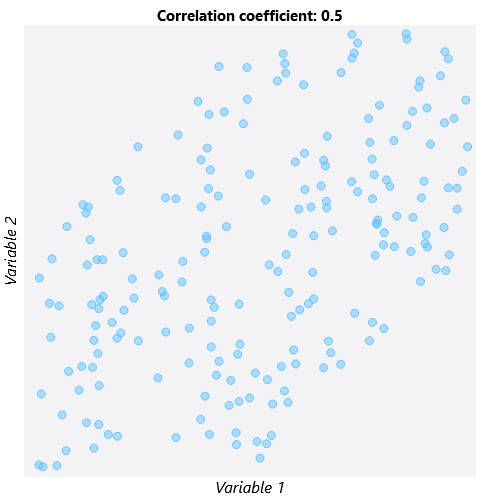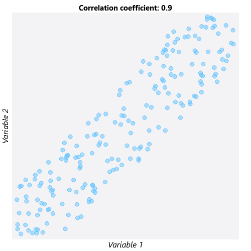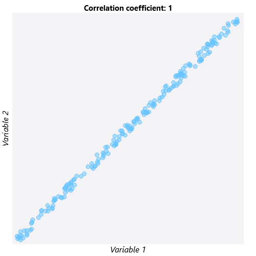

1.  *Causation* describes not only the strength or pattern of a relationship but also the MECHANISM of a relationship. In a causal relationship, variable X CAUSES a change in variable Y; we know that X must happen before Y.

## Thinking Counterfactually

The second important concept we must learn is *counterfactual thinking*. Counterfactual thinking is the process of asking, “What WOULD have happened if circumstances were different?” Let’s illustrate counterfactual thinking using the following example:

Dogs are often called “human’s best friend,” but did you know there may be a biological explanation behind this saying? Research has shown that just a few minutes of interacting with dogs or cats can reduce levels of cortisol, a hormone linked to stress that may lead to weight gain or a weakened immune system. Let’s say we’re interested in learning whether interacting with a trained therapy animal leads to decreased levels of cortisol in hospital patients.

Approaching this using counterfactual thinking, we must consider what each patient’s cortisol level would be in two different “universes”:

-   In one universe, a patient interacts with a therapy animal—we will call this “Universe T.”
-   In the other universe, referred to as “Universe C,” the same patient does NOT interact with a therapy animal.

The cortisol levels in these two parallel universes are called *potential outcomes* because either could potentially be observed. But in reality, we can only observe one cortisol level for a particular patient at one specific moment in time.

Assume that a patient exists in Universe T and ACTUALLY interacted with a therapy animal. The cortisol level observed in this scenario is the *observed* or *factual outcome* because it is the outcome that was observed. The cortisol level that would have been observed if the patient existed in Universe C and did not interact with the therapy animal would be the *counterfactual outcome*. We can never actually observe the counterfactual outcome.

Using counterfactual thinking allows us to compare the exact same person at the exact same time under two different circumstances. Because the only difference between the two universes is that the patient received the treatment in Universe T and the control in Universe C, we could compare the cortisol levels from each universe to get an estimate of the effect of interacting with therapy animals.

The two images below illustrate which outcome is the factual outcome and which is the counterfactual outcome when universe T and universe C are true. When the individual is actually in universe T, the cortisol level observed in universe T is the factual outcome and the cortisol level observed in universe C is the counterfactual outcome. If the individual is actually in universe C, the reverse is true.

 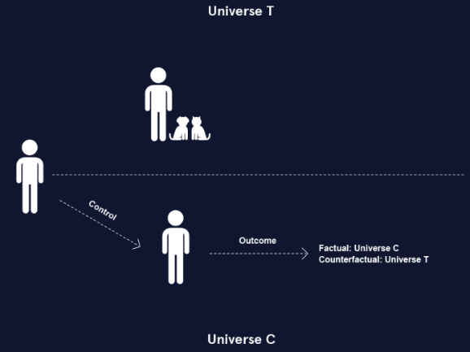

## Potential Outcomes Notation

In order to generalize our understanding of the potential outcomes framework, we will now introduce some notation that will be used throughout the rest of this course.

-   Z represents the treatment or exposure condition. When Z is binary, there are only two possible treatment conditions: treatment (Z = 1) or control (Z = 0).

    (Z could also be a continuous variable, such as medication dosage or number of days in the hospital, but our example assumes that there are only two treatment conditions for simplicity.)

-   Y represents the observed value of the outcome variable.

In the potential outcomes framework, we consider how the Y values we observe would change if the treatment were different:

-   When Z is binary, the two potential outcomes are represented with Y1 and Y0:
    -   Y1 is the potential outcome under the treatment condition (Z = 1).
    -   Y0 is the potential outcome under the control condition (Z = 0).

In real life, an individual can only be in one treatment group at any specific point in time. Thus, we can never know the value of both potential outcomes for an individual. We will discuss how to deal with this problem in future exercises. For now, assume that we could know the values of both Y0 and Y1.

## A Missing Data Problem

If we knew both potential observations for every individual, we could use them to estimate several different statistics that summarize the effect of the treatment:

-   The *individual treatment effect* (ITE) is computed as Y1 - Y0. This statistic directly compares the two potential outcomes for each individual.
-   The *Average Treatment Effect* (ATE) is the average of all individual treatment effects, which can be calculated as the difference between the average of Y1 and the average of Y0.

Hold up! You may be wondering, “How are we supposed to calculate the individual treatment effect or true ATE if we can never observe the counterfactual outcome?” This question gets at the fundamental problem of causal inference. Causal inference is essentially a missing data problem: since we can only observe the outcome that actually happened, we are always missing the counterfactual outcome.

The tables below show data for 12 hospital patients who either interacted with a therapy animal (Z = 1) or did not interact with a therapy animal (Z = 0). “Theoretical” refers to the theoretical data unobservable in real life and “Reality” refers to what we could actually observe from these 12 patients in reality.

The theoretical data contains both potential outcomes. Because we have both potential outcomes, we can compute the true ATE by subtracting the potential outcome averages. The true ATE is -5.8, which means that interaction with therapy animals results in an average decrease in cortisol levels of 5.8 units.

The real data contains only one potential outcome for each individual. Notice now that the Y1 values are missing for individuals in the control group (Z = 0), and the Y0 values are missing for individuals in the treatment group (Z = 1). In real life, we will always be missing half of the data we need to calculate the true ATE.

**Theoretical   Reality**

 

## Estimating the ATE

Because we can never know both potential outcomes for an individual, we need to use a different method to estimate causal effects. The most accurate way to do this is to use *randomization*.

Randomization is a method of treatment group assignment that is essentially a coin flip to determine whether an individual receives the treatment or the control. This ensures that, for a large enough sample size, the treatment groups will be similar on average with respect to all factors EXCEPT for the treatment condition. While we still won’t know the counterfactual outcome for any individual, we can be reasonably confident that similar individuals received each treatment. This allows us to estimate the potential outcomes we weren’t able to observe.

When randomization is possible, we can estimate the ATE by taking the difference of the average observed outcome values in the treatment and control groups. In the example, the estimated ATE equals -5.4, which is very close to the true ATE of -5.8 that was calculated in the previous exercise.

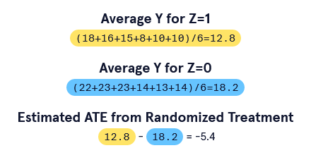

## Confounders and Selection Bias

Often, randomization of treatment is unethical. For example, it would be unethical to force hospital patients who don’t like animals to receive therapy animal services. Randomized experiments can also be expensive and demand a lot of resources. It is often more practical to use data that is already available. In these scenarios, the treatment group is not random but is based on other factors, such as personal preference.

When randomization is not possible or plausible, several sources of bias can impact the accuracy of estimated causal effects. One source of bias is *selection bias*. Selection bias is bias that happens because of how individuals were put into the treatment or control groups.

In terms of our therapy animal example, selection bias might arise if:

-   individuals choose whether they want the therapy (dog-lovers might be over-represented in this case)
-   individuals in the control group come from a different hospital
-   individuals are only able to receive the therapy based on another variable, such as insurance coverage

If any of these variables that are associated with treatment assignment are also related to the outcome variable (cortisol level), they are considered *confounders*, or *confounding variables*. These variables may lead us to incorrect conclusions about the impact of the treatment on the outcome.

The following is a graphical representation of how the confounder X is associated with both the treatment Z and outcome Y:

To illustrate the concept of confounding variables, consider the following example. Suppose we are interested in learning about the effect of coffee on blood pressure. If we assume that there are no confounding variables impacting coffee intake or blood pressure, the causal relationship would look something like the first diagram where drinking coffee and high blood pressure are linked by a single arrow.

Assuming that there are no confounders that are related to both coffee intake and blood pressure is unrealistic from a scientific perspective. We know that people who smoke cigarettes tend to drink more coffee than people who do not. We also know that nicotine in cigarettes is associated with higher blood pressure. Therefore, it is reasonable to conclude that cigarette smoking is a potential confounder in the relationship between coffee intake and blood pressure. In our diagram, we add smoking cigarettes as a confounder that points to both drinking coffee and high blood pressure.

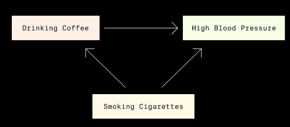

## Estimating the ATE with Confounders

So how do we deal with confounders and estimate the ATE when the treatment assignment is not randomized? Let’s return to the therapy animal example once more.

Suppose that instead of randomizing patients to receive therapy animal services, we allow the twelve hospital patients to CHOOSE whether or not they want therapy. Imagine that we also have data for a new confounding variable X that represents whether an individual does (X = 1) or does not (X = 0) have a diagnosis of anxiety disorder. Here, X is a confounder and impacts both the treatment and the outcome: patients who have anxiety might be more likely to choose to receive therapy animal services AND have higher cortisol levels generally.

This confounding is problematic because it means there may be more people with anxiety in the treatment group than in the control group. More people with anxiety means the treatment group may have a higher average cortisol level compared to that of the control group before therapy animal services even occur!

When the treatment groups are unbalanced with respect to confounders, the treatment groups are not *exchangeable*: we would observe different outcomes if the treatment groups swapped treatment conditions.

To avoid making poor comparisons between potentially imbalanced treatment groups, we have to be able to assume *conditional exchangeablility*:

-   *Conditional exchangeability* means that the treatment groups are exchangeable if we take into account confounding variables.
-   This is also called *ignorability* or *unconfoundedness*.

By taking anxiety diagnosis (variable X) into account, we avoid getting a biased estimate of the cortisol levels produced by those receiving therapy animal services in comparison to those who do not.

The following example shows how the anxiety confounder might bias our estimate of the treatment effect in our therapy animal analysis.

**Non-randomised treatment ignoring X**

In our table, we have the data for our twelve hospital patients who chose whether or not to receive therapy animal services. The variables include anxiety diagnosis (X=1 for anxiety and X=0 for no anxiety) and treatment assignment (Z=1 for therapy and Z=0 for no therapy). Because this is reality, we cannot see both potential outcomes but rather just the observed outcome Y (observed cortisol level).

If we compute the estimated ATE as though treatment was randomized and don’t take anxiety (X) into account, we get an estimated ATE of -2.9. We conclude that therapy animal services reduce cortisol levels by 2.9 units on average.

**Estimated ATE for X=1**

In order to account for the anxiety variable, we first compute the ATE for just those patients diagnosed with anxiety disorder (X=1). We do this as we always do: by subtracting the average cortisol level for the control patients from the average for the treated patients. Because we are only comparing patients with anxiety, the groups should theoretically have similar cortisol levels before receiving therapy. We find an estimated ATE of -5.5 for individuals with anxiety—much greater in magnitude than our initial estimate of -2.9.

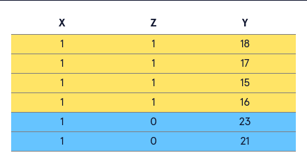****

**Estimated ATE for X=0**

Now we compute the ATE for just those patients NOT diagnosed with anxiety disorder (X=0). We find an estimated ATE of -5.5 for individuals WITHOUT anxiety.

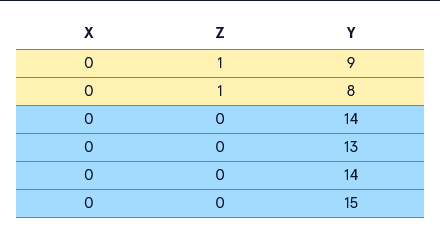****

**Comparison of ATE effects**

Averaging the ATEs of our two groups gives us an estimated ATE of -5.5 when we take X into account. If we recall from Exercise 5, the true ATE was -5.8: therapy animal services reduced cortisol levels by 5.8 units on average. Our estimate when we took confounding into account was much closer to the true treatment effect.

Why did this happen? Anxiety correlated with higher cortisol, and more people with anxiety were in the treatment group. This made the treatment group’s cortisol levels tend toward higher levels, making it look as though therapy animal services were not bringing down cortisol levels by much.

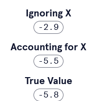

## Assumptions

The last exercise brought up one assumption used throughout causal inference: conditional exchangeability. In this lesson, we will learn a few more assumptions.

A second assumption made in causal inference is *Stable Unit Treatment Value Assumption* (SUTVA). The name is a mouthful, but it’s a pretty simple assumption that can be broken down into two components:

1.  An individual’s treatment assignment doesn’t impact the outcome of other individuals. Using the example of the hospital patients, this would mean that one individual getting therapy animal services doesn’t impact the stress level of other individuals in the hospital.
2.  The treatment (or control) is applied exactly the same way to all patients. For example, the patients receiving therapy animal services should receive therapy for the same amount of time and ideally from the same exact animal to ensure consistent treatment.

The next assumption we need to familiarize ourselves with is *overlap*. The assumption of overlap means that all subgroups of patients divided by their characteristics have a positive, non-zero probability of getting either treatment assignment. Overlap is also referred to as the *common support* or *positivity* assumption.

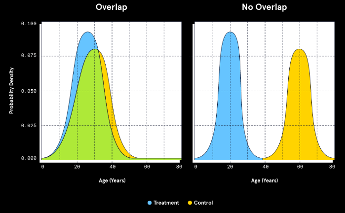

The left half of the plot shows an example of when the assumption of overlap is met. For individuals of all ages, there is a positive probability of being assigned to either the treatment or control group. No age has a 100% probability of being assigned to treatment and a 0% probability of being in the control group or vice versa. The area of overlap is called the *region of common support*.

In contrast, the right half of the plot shows when the assumption of overlap is NOT met.

-   Patients under the age of about 38 have zero probability of being assigned to the control group.
-   Patients above the age of 38 have no probability of being assigned to the treatment group.

If we try to make inferences based on the groups with no overlap, we are comparing a group of treated younger individuals to a group of untreated older individuals. We cannot reasonably assume age does not also affect our outcome.

## Other Causal Estimands

So far, we’ve only focused on the ATE, but there are many other useful estimands we can use to summarize the average causal effect of some intervention or exposure. In many situations, it is not realistic to meet the assumptions of conditional exchangeability, SUTVA, AND overlap. Other causal estimands allow us to relax some of these assumptions.

The ATE summarizes the causal effect of treatment across ALL treatment conditions. But, we may only be interested in the causal effect of treatment in a particular group. In these cases, we can use a different estimand:

-   *Average Treatment Effect of the Treated* (ATT) is the average of Y1 - Y0 for all individuals assigned to the treatment condition (Z = 1).
-   *Average Treatment Effect of the Control* (ATC) is the average of Y1 - Y0 for all individuals assigned to the control condition (Z = 0).

There are other estimands we may encounter in causal methods, but the ATE, ATT, and ATC are three that we see in a variety of situations.

The table shows theoretical data as well as which subsets of that data we use to calculate the ATT and ATC. Here, because the data is theoretical, we have both the factual and counterfactual outcomes for each individual, so we can compute both the ATT and the ATC.

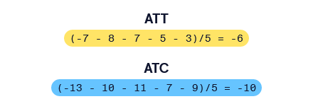

## Causal Inference Process

Now that you have some experience with the assumptions needed for causal inference as well as familiarity with a few causal estimands, we need to set up a structured way to apply what you’ve learned when approaching causal inference problems.

We can think of causal inference as a two-step process.

1.  *Identification:* During this stage we determine which causal estimand we will estimate based both on what we want to know and on what we are able to compute. We must also determine whether we will be able to meet the three assumptions in order to infer that the relationship is causal in nature.
2.  *Estimation:* Now that we’ve reasoned what can compute and that this measure will reflect a causal relationship between variables, we must carry out the statistical model to compute the treatment effect. We used some simple computations throughout this lesson, but we will soon use more complicated methods like multiple linear regression to obtain our estimand.

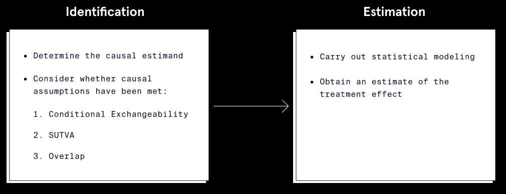

The flowchart summarizes the two steps in the causal inference process: Identification and Estimation. Think about these steps as we would have applied them in our therapy animal example.

**  
**

**Identification**

-   *Estimand:* Are we interested in computing the ATE for all patients, or do we only care about the effect of therapy animals on the patients who were treated (ATT)? Are we able to compute the ATE in this case? When might we NOT be able to compute the ATE?
-   *Assumptions:*
1.  *Conditional Exchangeability:* Are the treatment and control groups exchangeable? Or do we need to account for other measures of confounding beyond just anxiety diagnosis?
2.  *SUTVA:* Does one patient receiving the therapy influence other patients to choose to receive the therapy? Is every patient receiving the same services (same frequency, same amount of time, same kind of animal)?
3.  *Overlap:* Does every patient have some probability of being in either therapy group? Or do some types of patients have no probability of being treated, such as those with allergies or those under age 18?

**Estimation**

-   Which statistical model will we use to estimate the treatment effect?
-   Are there any additional assumptions that need to be met to use this technique?

## Review

In this lesson, you learned:

-   Causation is different from association in that it implies a relationship where a change in one variable leads to a change in another variable.
-   If we could view both potential outcomes, we could accurately compute the true effect of a treatment.
-   The fundamental problem of causal inference is that we only get to view the observed outcome and not its counterfactual.
-   When randomization is not available to produce estimates of treatment effects, we must use other strategies to predict counterfactuals and find our estimand of interest.
-   The three main assumptions for causal inference are:
    -   Conditional exchangeability
    -   SUTVA
    -   Overlap
-   The causal inference process can be thought of as two steps: identification and estimation.

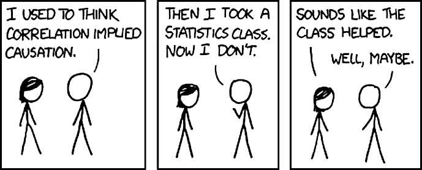
