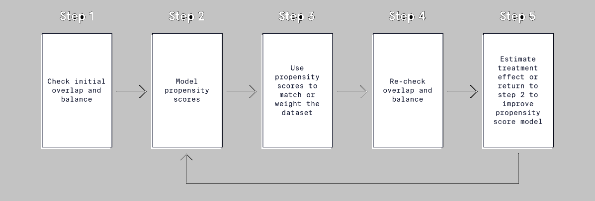
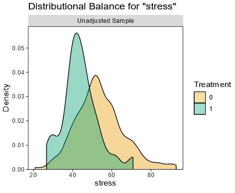
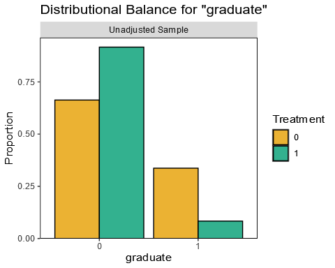
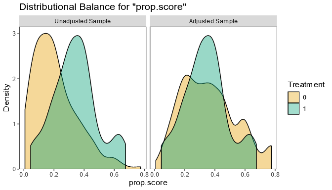
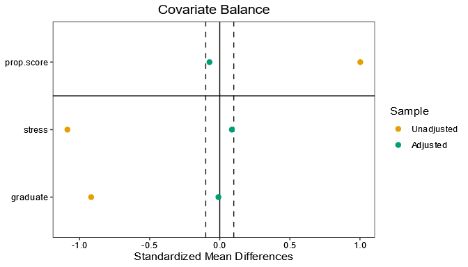

# Matching and Weighting Methods – Propensity Scores

## What are Propensity Scores?

One of the main assumptions in causal inference is known as the assumption of *conditional exchangeability*. This assumption states that, so long as we account for confounders (the non-treatment, non-outcome variables), we would observe the same outcomes if the treatment and non-treatment groups were swapped. Conditional exchangeability is achieved via randomization since it balances both observed AND unobserved variables between treatment groups. However, conditional exchangeability can be difficult to achieve in non-randomized situations.

Propensity score methods are widely used in causal inference because they can help reach conditional exchangeability even when randomization is not possible. So what are propensity scores, and how can we apply propensity score methods to our own questions?

A *propensity score* is essentially the probability of being in a particular treatment group given a set of observed variables. Typically we will think of propensity scores as the probability of being in the treatment group as opposed to the control group. In a sense, propensity scores summarize all the traits of an observation to a single score, which can be an advantage when there are lots of observed variables.

Propensity score analyses can be broken down into five ordered steps:

1.  Check initial overlap and balance.
2.  Model propensity scores.
3.  Use propensity scores to weight the dataset.
4.  Re-check overlap and balance.
5.  Estimate the treatment effect, or return to step two to improve the propensity score model.



## Variable Overlap and Balance

The first step in a propensity score analysis is to check how similar the treatment and control groups are at baseline, before using propensity score methods. There are two measures that are commonly used to describe the degree of similarity between treatment groups: *overlap* and *balance*.

-   *Overlap* is the range of values of a variable that the treatment and control groups have in common.
    -   *Overlap* can also be thought of as the range of values of a variable where the probability of being in the treatment group is greater than 0 but less than 1.
    -   We already know that overlap is an important assumption of causal inference!
-   *Balance* describes how similar the treatment and control groups are with respect to the entire distribution of each of the other variables.
-   Balance is expressed as a statistic that summarizes the entire distribution of a variable. Two statistics are commonly used to measure balance.
1.  *Standardized mean difference* (SMD). The SMD of a variable in a sample is defined as the difference in the average value of the variable between groups divided by the standard deviation of the variable in both groups.
2.  *Variance ratio*. The variance ratio of a variable in a sample is the variance of the variable in one treatment group divided by the variance of the variable in the other treatment group.

So how is “good” or “bad” balance defined?

-   An SMD close to zero indicates good balance. This means the average value (and thus the center of the distribution) of the variable is similar between the treatment and control groups.
-   A variance ratio close to one is another indicator of good balance. This means that the variability, or spread, of the variable is the same in both groups.

## Visual Check of Numeric Variables

Suppose we are interested in determining whether the practice of meditation increases the amount of sleep that university students get per night. To gather more information, we surveyed 250 students about their sleeping and meditation habits over the previous year. Note that students were not randomly assigned to treatment groups; students were simply asked about their actions. Their responses were recorded in a dataset with these variables:

-   `sleep` — average hours of sleep per night (outcome variable)
-   `meditate` — indicates whether or not the individual reports consistent use of meditation (treatment group variable)
-   `stress` — a self-reported measure of stress on a 1-to-100 scale, with 1 representing no stress and 100 representing extremely high stress
-   `graduate` — indicates whether or not a student is in a graduate program versus an undergraduate program (0 = undergraduate; 1 = graduate).

We can use the `bal.plot()` function from the R package, cobalt, to visually check if any variables are severely imbalanced and whether propensity score methods might be useful. The function takes a formula where the left side specifies the treatment group indicator and the right side includes a variable we want to view. To check the `stress` variable, the formula would be `meditate ~ stress`. Then we specify the dataset name and the variable of interest in quotes as additional arguments.

```
# import library
library(cobalt)
# plot distributions for stress variable
bal.plot(
  x = meditate ~ stress, #formula
  data = sleep_data, #dataset
  var.name = "stress" #variable
  colors = c("#E69F00", "#009E73") #set fill colors
)
```

Note that we also set the optional argument `colors` to c("\#E69F00", "\#009E73") for better contrast.



The distributions in the plot appear to differ pretty substantially between the treatment groups, potentially indicating poor balance. The meditation group (green) is centered around a score of 40 with a narrow spread, while the non-meditation group (orange) is centered around 55 with a much wider spread of stress scores.

## Visual Check of Categorical Variables

Distribution plots are great for numeric variables, but we need a different type of plot for categorical variables. Fortunately, we can use the exact same `bal.plot()` function from cobalt with no need to specify the variable type. By updating the arguments for `x` and `var.name` to use `graduate`, we will get a bar plot to examine balance for the categorical variable `graduate`.

```
# import library
library(cobalt)
# plot distributions for stress variable
bal.plot(
  x = meditate ~ graduate, #new formula
  data = sleep_data, #dataset
  var.name = "graduate", #new variable
  colors = c("#E69F00", "#009E73") #set fill colors
)
```



From this plot, we see that the ratio of undergraduates to graduates is much larger for the meditation group (green) than for the non-meditation group (orange).

Both plots so far suggest that there are differences between the treatment and control groups with respect to the `stress` and `graduate` variables. However, balance plots don’t precisely quantify the degree of imbalance in the dataset. To get a more detailed picture, we can check balance numerically.

## Checking Balance Numerically

While visual assessments of balance are definitely helpful, we can also assess overlap and balance numerically using the standardized mean difference (SMD) and variance ratio for each variable.

Observing an SMD of exactly zero or a variance ratio of exactly one is pretty uncommon. Therefore, the following guidelines can be used to indicate good balance:

-   SMD between -0.1 and 0.1
-   Variance ratio between 0.5 and 2.0

The `bal.tab()` function from the cobalt package is a complement to the `bal.plot()` function that quantifies the balance of variables in a dataset. The `bal.tab()` function has similar arguments and syntax to the `bal.plot()` function. We need to update our formula to include both variables of interest. Then we can show SMDs for all variables and variance ratios for all continuous variables in the sleep dataset by specifying `binary = "std"` and `disp.v.ratio = TRUE`, respectively:

```
# import library
library(cobalt)
# print table of SMDs and variance ratios
bal.tab(
  x = meditate ~ stress + graduate, #formula
  data = sleep_data, #dataset
  disp.v.ratio = TRUE, #display variance ratio
  binary = "std" #SMDs for binary variables
)
```

The output of the `bal.tab()` that follows shows that the `stress` variable has an SMD of -0.9132 and a variance ratio of 0.5461 between the treatment and control groups. The `graduate` variable has an SMD of -0.6548.

```
Balance Measures
            Type    Diff.Un   V.Ratio.Un
stress    Contin.   -0.9132       0.5461
graduate  Binary    -0.6548
 
Sample Sizes
        Control Treated
All        190      60
```

The SMDs clearly fall outside the range of -0.1 to 0.1, which suggests there is an imbalance between the treatment and control groups. The variance ratio for the `stress` variable is only just within the acceptable range. Time to put propensity score methods to the test to see if we can reduce this imbalance!

## Modelling Propensity Scores

Returning to our student sleep data, we are interested in the effect of meditation on sleep. It seems intuitive that people with high levels of stress might struggle with sleep AND might be less likely to engage in coping mechanisms such as meditation. We can use propensity scores to model this interaction.

Propensity scores reflect the probability of being in the treatment group, as opposed to the control group, given a set of characteristics. Because this probability corresponds to a binary outcome—either being in the treatment group or the control group—we can model the propensity scores using logistic regression. The outcome of the regression will predict whether or not an individual is in the treatment group. It will use potential confounding variables as predictors.

With regards to our sleep data, the propensity score should model the probability of practicing meditation based on the other characteristics in the data. Let’s start with a propensity score model with the `meditate` variable as the outcome and the `stress` variable as a predictor.

The `glm()` function in R makes modeling propensity scores via logistic regression simple. By default, the `glm()` function fits a linear regression model, so we need to modify the `family` argument to specify that the treatment group variable is binary. To do this, we set the `family` argument to `"binomial"`:

```
prop_model <- glm(
  formula = meditate ~ stress, #formula
  data = sleep_data, #dataset
  family = "binomial" #specify logistic regression
)
```

To get a sense of what the propensity scores produced from a logistic regression look like, let’s take a look at a histogram of the propensity scores from `prop_model`.


The plot indicates that our model produced a lot of low probabilities of being treated for our observations. This makes sense given that the `bal.tab()` output in the last exercise showed us we had 190 students in the non-meditation group and only 60 in the meditation group.

## Propensity Score Weighting

Now that you know about the basics of propensity scores, let’s talk about some possible applications.

Propensity scores often show up in matching and stratification. However, we will focus on *propensity score weighting* because it is a popular choice with strong performance.

Propensity score weighting transforms estimated propensity scores into *weights* that emphasize or diminish certain observations in our dataset. One widely used type of propensity score weighting is known as inverse probability of treatment weighting (IPTW).

IPTW weights are calculated differently depending on whether we want to estimate the average treatment effect (ATE) or the average treatment effect on the treated (ATT). Note that with ATE we are looking at the effect across the entire population, both the treated and control groups. ATT is just on the treated group.

The formulas for the treatment and control group weights for each estimand are below. `p` represents the propensity score for a particular individual.

|                  | ATE         | ATT         |
|------------------|-------------|-------------|
| Treatment Weight | 1 / p       | 1           |
| Control Weight   | 1 / (1 – p) | p / (1 – p) |

It may not be immediately obvious, but these formulas tell us that IPTW makes the treatment and control groups appear more similar in two ways:

-   By giving MORE weight to individuals who look like those in the **opposite** treatment assignment.
-   By giving LESS weight to individuals who look like those in their own treatment assignment.

Check out the following table that shows some example weights for treatment and control observations using IPTW for the ATE.

| Treatment group | Propensity score | Weight |
|-----------------|------------------|--------|
| Treatment       | 0.1              | 10.0   |
| Treatment       | 0.5              | 2.0    |
| Treatment       | 0.9              | 1.1    |
| Control         | 0.1              | 1.1    |
| Control         | 0.5              | 2.0    |
| Control         | 0.9              | 10.1   |

Note the pattern:

-   The treated individual with the low propensity score of 0.1 (looks more like a control) is given a high weight of 10.
-   The treated individual with the high propensity score of 0.9 (looks like the other treated individuals) is given a low weight of 1.1.
-   The weighting goes in the opposite direction for the controls.

The justification for this method is that someone who looks more like the individuals in the other treatment group is a better counterfactual for them, so we count these individuals as more important. This helps balance our treatment groups without discarding any observations.

## Performing IPTW in R

If this seems like a lot of work, don’t worry! The WeightIt package in R has functions to model the propensity scores and simultaneously perform propensity score weighting. We don’t need to make a separate logistic regression or compute the weights manually using a formula.

IPTW can be performed in R with the `weightit()` function from the `WeightIt` package. There are several key arguments to this function that allow us to tweak how weighting is performed.

-   `formula`—represents the propensity score model to use.
-   `method`—determines the weighting method that will be used. While there are various options, we will use “ps” to perform IPTW using logistic regression.
-   `estimand`—specifies the desired treatment effect estimand: “ATE” for average treatment effect, “ATC” for average treatment effect on the controls, or “ATT” for average treatment effect on the treated.

To perform IPTW for the ATT on the student sleep data, we fill in these arguments accordingly. Remember that our propensity score model includes `meditate` as the outcome and only `stress` as the predictor.

```
# import library
library(WeightIt)
# model propensity scores and IPTW weights
iptw_sleep <- weightit(
  formula = meditate ~ stress, #propensity model
  data = sleep_data, #dataset
  method = "ps", #use IPTW
  estimand = "ATT" #estimand
)
```

The `weightit()` function models the propensity scores and creates the IPTW weights in one step. We save these outputs in a `weightit` object we name `iptw_sleep`, which we will use in our next step.

## Re-Checking Overlap and Balance

If propensity score weighting is successful, we expect the distribution of propensity scores in the treatment group to be similar to that of the control group.

To check the overall balance of propensity scores, we can again use the `bal.plot()` function from the cobalt package. This time we pass the `weightit` object to the `x` argument and `"prop.score"` to the `var.name` argument, with no need for the `data` argument. Lastly, we set `which` equal to `both` so we can view the propensity scores before (“unadjusted”) and after (“adjusted”) weighting is performed.

```
# import library
library(cobalt)
 
# create balance plot of propensity scores
bal.plot(
  x = iptw_sleep, #weightit object
  var.name = "prop.score", #propensity scores
  which = "both", #before and after
  colors = c("#E69F00", "#009E73") #sets fill colors
)
```



The distributions of propensity scores look similar after IPTW, but we should check the balance of individual variables, too. The `love.plot()` function in cobalt visually checks the standard mean differences (SMD) between treatment groups for all variables before and after weighting. We can also show guidelines at ±0.1 SMD by setting `thresholds = c(m = 0.1)`.

```
love.plot(
  x = iptw_sleep, #weightit object
  binary = "std", #use SMD
  thresholds = c(m = 0.1), #guidelines
  colors = c("#E69F00", "#009E73") #sets fill colors
)
```


Oh no! Based on this plot, it appears as if the propensity score weighting was unsuccessful: the SMDs between groups are outside the ±0.1 cutoffs for the `stress` variable and for the propensity scores themselves. Since there is still some residual imbalance between treatment groups, we should backtrack to step 2 and refine the propensity score model.

## Refining the Propensity Score Model

As you may have noticed, propensity score methods are an iterative process: we check variable balance, model propensity scores, perform weighting, then check balance again. If imbalance still exists, we can change the propensity score model. A main assumption of propensity score weighting is that we’ve modeled the propensity scores correctly — a poor model could lead to biased estimates of the treatment effect!

Let’s update our propensity score model from the student sleep data to see if imbalances between groups can be reduced further.

The initial propensity score model only included the `stress` variable as a predictor of meditation, but what happens if we add the `graduate` variable as a second predictor? We need to update the formula in the `weightit()` function:

```
# import library
library(WeightIt)
# update weightit object
iptw_sleep_update <- weightit(
  #new formula
  formula = meditate ~ stress + graduate,
  data = sleep_data,
  estimand = "ATT",
  method = "ps"
)
```

We re-check balance again to see if the new propensity score model produces a better balance between groups.

```
# import library
library(cobalt)
# create Love plot of updated model
love.plot(
  x = iptw_sleep_update, #updated model,
  binary = "std", #show SMD
  thresholds = c(m = 0.1), #guidelines
  colors = c("#E69F00", "#009E73") #fill colors
)
```



Success! Both plots show that this new propensity score model produces improved balance. The SMDs now fall between -0.1 and 0.1.

Note that it can take multiple tries to find a good propensity score model. If we needed to further refine our model, we might add more complex terms to the equation, such as polynomial terms or interactions.

## Estimating Causal Effects

Now that we have a good balance, we can proceed to the last step of a propensity score analysis: estimating the causal treatment effect.

If we think back to the beginning of our lesson, the motivation for studying student sleep was to estimate the effect of meditation on average sleep in university students. So, to estimate the causal treatment effect of meditation, we need to fit a regression model for the outcome variable (hours of sleep) and incorporate the propensity score weights from our `weightit` model.

The final regression model should include hours of sleep as the outcome variable, use of meditation as the treatment group variable, and stress level and graduate status as the other predictor variables.

To use the propensity score weights from IPTW, we set the `weights` argument of the `glm()` function equal to the estimated IPTW weights. These are stored in our updated `weightit` model that we called `iptw_sleep_update`.

```
outcome_mod_weight <- glm(
  #outcome model
  formula = sleep ~ meditate + stress + graduate,
  #dataset 
  data = sleep_data,
  #IPTW weights
  weights = iptw_sleep_update$weights 
)
```

To get the estimated treatment effect, we use the `coeftest()` function from the lmtest package. Weighting can cause our standard errors to be inaccurate. To get the best estimate of the treatment effect, we need a more *robust* calculation of the standard errors, so we add the argument `vcov. = vcovHC` made available by the sandwich package. We won’t cover this in detail here, but this adjustment means we are using a *heteroscedasticity-consistent estimation of the covariance matrix* for estimates of the coefficients.

```
# import library
library(lmtest)
library(sandwich)
# perform tests of regression coefficients
coeftest(
  outcome_mod_weight, #weighted outcome model
  vcov. = vcovHC #robust standard errors
)
```

As we can see in the following output, the coefficient for the meditation variable is 1.02. If we have met the assumptions of IPTW, this means that we can conclude that a typical student who practiced meditation got an additional 1.02 hours of sleep because of meditation.

```
z test of coefficients:
 
              Estimate  Std. Error  z value   Pr(>|z|)
(Intercept)   8.971964    0.669241  13.4062  < 2.2e-16 ***
meditate      1.024871    0.215333   4.7595  1.941e-06 ***
stress       -0.045191    0.013664  -3.3072  0.0009422 ***
graduate     -0.770913    0.280460  -2.7487  0.0059823 **
---
Signif. codes:  0 '***' 0.001 '**' 0.01 '*' 0.05 '.' 0.1 '' 1
```

## Conclusion

Congratulations! You have learned a lot about propensity score methods in this lesson and are quickly becoming a master of causation (not just correlation).

In this lesson, you learned:

-   There are five stages of using propensity scores in causal inference.
-   A propensity score is computed by predicting the probability of treatment from the other observed variables.
-   We use propensity scores in Inverse Probability of Treatment Weighting (IPTW) to create balance across observed variables.
-   We can check balance between treatment and control groups across variables using the cobalt package functions `bal.tab()`, `bal.plot()`, and `love.plot()`.
-   A poor propensity score model may lead to biased estimates of the treatment effect, so it is very important that we find the best model possible.
-   We get an estimate of the treatment effect by creating a regression model with IPTW weights.


