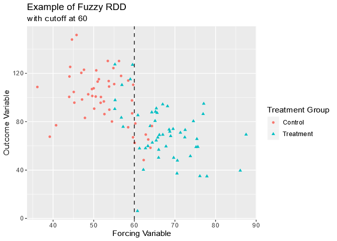
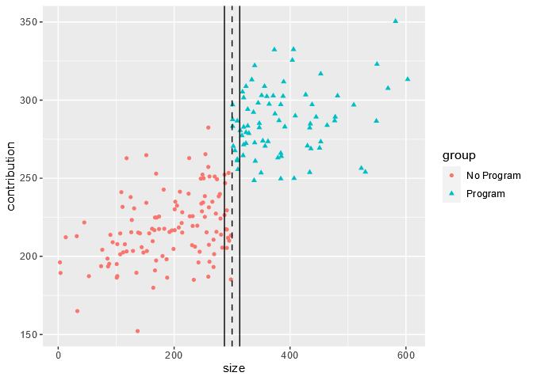
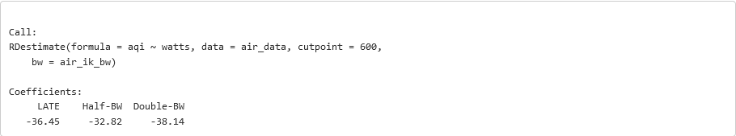

# Regression Discontinuity Design (RDD)

## The Case for RDD

Research suggests that individuals put more into retirement accounts or pension plans if their employer matches a portion of their contributions.

Imagine that a country’s legislature passes a law that requires employers with more than 300 employees to provide a retirement contribution matching program. Using tax data, lawmakers compile a dataset with the following information from each of 200 different companies:

-   `size`: Number of employees
-   `group`: Contribution Matching Program Group (“No Program” vs. “Program”)
-   `contribution`: Average monthly employee contributions (in dollars)

Number of employees — acting as the forcing variable with a cutoff at 300 employees — dictates whether or not a company has a contribution matching program.

We want to assess whether the policy caused an increase in average monthly retirement contributions by employees. This example is a perfect candidate for a new technique, called regression discontinuity design.

RDD works by only focusing on the points near the cutoff. Companies with close to 300 employees are probably very similar to one another. So the ONLY difference, on average, between companies with 299 employees and those with 301 employees should be whether they have the contribution matching program. This means we should have a treatment and control group that look a lot like those of a randomized experiment!

The plot shows shows the contribution matching program data. The number of employees (forcing variable) is on the x-axis, and the average monthly contribution (outcome variable) is on the y-axis.

Do you think that companies with 5 employees are similar to companies with 600? What about companies with 200 employees versus 400 employees?


## Forcing Variables

We need a little more vocabulary before we can dive into more details about Regression Discontinuity Design.

Sometimes treatment group assignment is dictated by one continuous variable known as a *forcing variable* (the company size in our example). The forcing variable, also referred to as a *rating variable* or *running variable*, has a cutoff value such that:

-   Individuals with a value smaller than the cutoff are in one treatment group.
-   Individuals with a value larger than the cutoff are in the other treatment group.

The treatment group is perfectly predicted by the forcing variable. In this scenario, we cannot rely on other causal inference techniques such as matching or weighting methods because there is not a consistent mixture of treatment and controls across different values of the forcing variable.

In the plot below, note how points with a value below 60 on the x-axis belong to the control group, while those with values above 60 belong to the treatment group.


## Sharp or Fuzzy?

The forcing variable cutpoint can either be exact or not exact:

If the cutpoint is exact, the probability of treatment changes from zero to one at the cutpoint. In other words, all observations on one side of the cutpoint are in the treatment group (and actually received the treatment) and all observations on the other side of the cutpoint are in the control group (and didn’t receive the treatment). This is known as a *sharp design*.

If the cutpoint is NOT exact, the probability of treatment doesn’t jump from zero to one at the cutpoint. In other words, there are individuals in each treatment group on BOTH sides of the cutpoint. This is known as a *fuzzy design*.



While this distinction may seem minor, it is actually incredibly important to recognize when to use sharp RDD as opposed to fuzzy RDD. Not only do the two approaches make different assumptions about the data, but they also require slightly different statistical methods.

We will focus on sharp RDD in this lesson, even though perfect compliance with the treatment assignment is not always realistic.

## Defining RDD Assumptions

We saw that our employee contribution example requires a sharp regression discontinuity design: all companies with at least 300 employees have a contribution matching program, and all companies with fewer than 300 employees do NOT have a contribution matching program. Before we decide which companies are similar enough to compare, we must consider some assumptions.

In order to get valid estimates of the treatment effect using a sharp RDD approach, several assumptions have to be met.

-   The treatment variable impacts the outcome, but not any of the other variables.
-   The treatment assignment happens only at ONE cutpoint value of the forcing variable.
-   Treatment assignment is independent of the potential outcomes within a narrow interval of the forcing variable around the cutpoint.
-   Counterfactual outcomes can be modeled within the interval around the forcing variable’s cutpoint.

For example:

1.  The contribution matching program impacts the amount that employees contribute, but no other variables.
2.  The contribution matching program is only required for companies with at least 300 employees.
3.  Companies with just under 300 employees and just above 300 employees are similar enough to one another with respect to other variables EXCEPT for the treatment group that the treatment assignment could be considered random.
4.  Employee contributions among companies that have slightly fewer or slightly more than 300 employees can be modeled to determine the causal effect of the program.

## Visual Check

A scatter plot of our data allows us to check certain RDD conditions visually. We can see whether we have a sharp or fuzzy cutoff. We can also use the plot to check for a *discontinuity* — a sudden change in the outcome variable — at the cutoff.

To create this scatter plot with the contribution matching dataset, we can use the `ggplot2` package in R:

`library(ggplot2) #load ggplot2 package
`

Our scatter plot should have the number of employees on the x-axis and the contribution amount on the y-axis. The points for treatment and control groups should be different colors and shapes, so we can easily tell the two groups apart. Finally, we add code for a dashed vertical line at the cutoff of 300 employees.

```
# create a scatterplot with treatment groups
ggplot(
  data = cont_data,
  aes(
    x = size, # forcing variable
    y = contribution, # outcome variable
    color = group, # sets point color by treatment group
    shape = group # sets point shape by treatment group
  )) +
  geom_point() + 
  geom_vline(xintercept = 300, linetype = "dashed") #add line at 300
```

This plot clearly shows that we have a sharp RDD, not a fuzzy one. The dashed line at 300 employees separates the two groups into companies that offer a matching program (at least 300) and companies that do NOT offer a matching program (fewer than 300).


We can also check to make sure that there is actually a discontinuity in average contributions based on whether or not companies have more than 300 employees. To do this, we can add a separate best fit line for each treatment group using the `geom_smooth()` function. If we had saved our first plot as `rdd_scatter`, we can add the code for the lines as follows:

```
# add best fit lines for each group to scatter plot
rdd_scatter +
  geom_smooth(
    aes(group = group), #plot separate lines for each group
    method = "lm" #use linear regression
)
```

There is an obvious jump in the average contributions at the cutoff point, which means there is a discontinuity present. If there were no discontinuity present, we might see something like the right image. Note that there is no jump in the outcome variable here. The lines connect smoothly.


## Choosing a Bandwidth

In RDD, we know we need to look at points near the cutoff to find treatment and control groups that are similar. But how do we know how close to look?

The *bandwidth* describes the distance on either side of the cutoff we should use to reduce our dataset. Any points that are more than one bandwidth above or below the cutoff are discarded. Choosing the bandwidth can have a serious impact on the results of an RDD analysis:

-   A wider bandwidth keeps more of the original dataset, so we have more information to estimate the treatment effect with. However, the treatment groups might be too different on confounding variables, which could decrease accuracy.
-   A narrower bandwidth retains less of the original dataset, so treatment groups will be more alike. However, the smaller sample size means less information to estimate the treatment effect.

We could select the bandwidth based on what we BELIEVE is best. However, an algorithm that optimizes the bandwidth mathematically may be a better choice. A popular choice—which we will use—is the Imbens-Kalyanaraman (IK) algorithm.

The R package `rdd` contains all of the tools needed to calculate the optimal bandwidth and carry out an RDD analysis. To calculate the IK bandwidth using `rdd`, we will use the `IKbandwidth()` function, which requires three arguments:

-   `X`: the forcing variable
-   `Y`: the outcome variable
-   `cutpoint`: the cutoff value to use.

To calculate the IK bandwidth for the contribution matching dataset, we would use the following code:

`library(rdd)
 
# calculate IK bandwidth
cont_ik_bw <- IKbandwidth(
  X = cont_data$size, # forcing variable
  Y = cont_data$contribution, # outcome variable
  cutpoint = cont_cutpoint # cutpoint
)
 
# print the IK bandwidth to the console
cont_ik_bw
[1] 13.26322`

The reduced dataset used in our RDD analysis will include only the companies that have between 286 and 314 employees (300 ± 13.26). Companies with between 286 and 314 employees are likely to be similar on other variables that may impact employee contributions, such as average salary or insurance costs.

To illustrate the bandwidth visually, we can add bandwidth lines to the scatterplot. We can use `geom_vline()` to add reference lines at the cutpoint ± the bandwidth to our scatter plot `rdd_scatter` from earlier:

```
rdd_scatter +
  geom_vline(xintercept = 300 + c(-cont_ik_bw, cont_ik_bw)) # add lines to indicate the bandwidth
```



This plot shows us just how narrow the optimal bandwidth is for the contribution program dataset.

## Estimating the Causal Treatment Effect

The use of a bandwidth impacts the type of causal estimand we can calculate in a regression discontinuity design analysis. Because the RDD approach uses a subset of the full dataset, we can only estimate the *local average treatment effect* (LATE). The LATE is the average treatment effect among the subset of data that falls within the range of the bandwidth.

To estimate the LATE in RDD, a regression model that allows for different slopes on each side of the cutpoint is fit. The regression model is then used to get a predicted value of the outcome variable for each treatment group at the cutpoint. The difference between the predicted outcome values of the treatment and control groups is an estimate of the LATE.

We can use the `RDestimate()` function from the `rdd` package as follows to fit the local linear regression model for the contribution matching data:

```
cont_rdd <- RDestimate(
  formula = contribution ~ size, #outcome regression model
  data = cont_data, #dataset
  cutpoint = 300, #cutpoint
  bw = cont_ik_bw #bandwidth
)
```

The `RDestimate()` function fits the local linear regression model at the provided bandwidth, but also at half of the bandwidth and twice the bandwidth. If the estimate of the LATE is relatively the same across bandwidths, we can be more confident that the estimate is accurate. We see all three estimates when we print the results.

```
Call:
RDestimate(formula = contribution ~ size, data = cont_data,
cutpoint = 300, bw = cont_ik_bw)
 
Coefficients:
    LATE    Half-BW  Double-BW
   90.60     110.67   71.62
```

The model output shows us that the LATE is 90.60, meaning that in this dataset, we can conclude that employer-sponsored retirement contribution matching programs led to an increase in average monthly contributions of \$90.60. However, we see that the estimate changes based on the bandwidth, ranging from \$110.67 at half of the bandwidth to \$71.62 at twice the bandwidth.

## Advantages and Disadvantages of RDD

As we’ve seen, the advantages of regression discontinuity design are that RDD:

-   Is a simple method to understand and implement.
-   Avoids using a complicated regression model for the entire dataset — the local regression model is simple.
-   Is useful in cases where there is no overlap on a confounding variable, which may prevent us from using stratification or propensity score analysis.

However, there are several drawbacks to RDD inherent to the method:

-   Smaller bandwidths make RDD assumptions more plausible BUT also reduce the sample size.
-   The local average treatment effect (LATE) is not an easily interpretable estimand. We calculated the effect of the contribution matching program only among the companies with close to 300 employees. How confident can we be that this effect would be the same in much smaller or larger companies?

Let’s explore the tradeoffs with an example. Say we run `RDestimate()` on the contribution data again, but set the bandwidth to 100 instead of the IK optimal bandwidth of 13. We save the results to `rdd_100` and print the output:

```
Call:
RDestimate(formula = contribution ~ size, data = cont_data,
cutpoint = 300, bw = 100)
 
Coefficients:
    LATE    Half-BW  Double-BW
   56.71      59.90      53.54
```

We can also get information on the number of observations included and the standard error of the LATE for each bandwidth with the code that follows.

```
rdd_100$obs #number of observations
# Output
[1] 113  68 178
 
rdd_100$se #standard errors
# Output
[1] 6.647 9.077 5.269
```

Let’s consider just the half-bandwidth (50) and the double-bandwidth (200). Using the half-bandwidth, we analyze only companies with 250-350 employees, so we may believe these companies are very similar to one another. But this leaves only 68 companies in our sample and a standard error of 9.077 for the LATE. We may ask:

-   Can we trust a LATE with a higher standard error?
-   Do these findings apply to companies outside the range of 250-350 employees?

At the double-bandwidth, we analyze companies with 100-500 employees, so our sample size is much larger at 178 companies and our standard error is reduced to 5.269. But how confident are we that companies with 100 employees are similar enough to compare to companies with 500 employees?

Regression discontinuity design is a useful method to keep in our causal inference toolbox, but we must be aware of the tradeoffs throughout the process.

## Conclusion

In this lesson, we showed that the implementation of an employee-sponsored retirement matching program led to an increase in average monthly employee contributions.

We learned a lot about regression discontinuity design along the way, including:

-   RDD is a method used when the treatment assignment is determined by a continuous forcing variable at a specific cutoff point.
-   An RDD is known as *sharp* if the cutoff is exact and *fuzzy* if the cutoff is not exact.
-   Individuals within a narrow window on either side of the cutoff are assumed to be similar to each other, except for the treatment group assignment.
-   Local linear regression can be used to determine the local average treatment effect (LATE) among the individuals in this narrow window.
-   Disadvantages of RDD include reduced sample size and potential lack of generalizability of the LATE.

In this lesson, you verified that RDD was an appropriate method to use, got causal estimates of the LATE using local linear regression, and examined the reliability of your results by using different bandwidths.

So what did this RDD analysis tell us? Based on the results of the local linear regression modeling, we can conclude that in our sample, emissions control devices led to a decrease in AQI of 36.45 points. This means that the emissions control device achieved its goal of providing cleaner air in close proximity to the power plants in our dataset.



