# Instrumental Variables

## Introduction

Suppose that a city is interested in increasing the per-capita rate of recycling among its citizens while decreasing the city’s operating costs.

To encourage this, the city allows individuals to discontinue curbside recycling pickup and instead opt into a rebate program. The city wants to evaluate whether or not this rebate program increases the amount of recycling in the city.

The city compiles the following variables in a dataset to evaluate the success of the rebate program:

`recycled`: amount recycled (kg/person).  
`rebate`: participation in rebate program (curbside vs. rebate).  
`distance`: distance from recycling center (5 miles vs. \> 5 miles). An individual who lives less than five miles from a recycling center might be more likely to opt into the rebate program than someone who lives more than five miles from a center. However, distance to a recycling center should not directly impact the amount of waste each person recycles.

We are going to use Instrumental Variables to answer the city’s question, but before we dive into that, we need to establish some more tools.

The first is **conditional exchangeability.**

One key assumption made in causal inference methods like weighting or stratification is *conditional exchangeability*. This assumption states that there are no unmeasured confounding variables that have a causal effect on both the treatment assignment and the outcome.

Randomization of the treatment assignment ensures that both measured and unmeasured confounding variables are evenly balanced between treatment groups. In a non-randomized setting, balance is NOT guaranteed. The assumption of conditional exchangeability cannot be tested or verified — in most cases, the best we can do without randomization is to identify and measure as many potential confounding variables as possible.

Instrumental variable (IV) estimation is a causal inference technique that helps us estimate the causal effect of the treatment even in the presence of unmeasured confounding variables. In this lesson, we will learn about the assumptions and potential applications of IV estimation.

The diagram below depicts the causal relationships between the treatment, outcome and confounding variables in a typical non-randomised study.

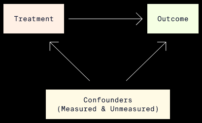

## Not That Kind of Instrument

In observational studies, when randomization is not possible, balance of measured and unmeasured confounding variables is not guaranteed. Without taking appropriate measures, the causal estimate of the effect of a treatment on an outcome of interest will be biased.

Instrumental variable (IV) estimation is one causal inference method that uses *instruments* to help reduce bias from both measured AND unmeasured confounding variables.

If you started this lesson hoping to learn about pianos and guitars, you may be disappointed. In IV estimation, an *instrument* (or *instrumental variable*) is a variable that is causally related to an outcome variable ONLY through another variable — typically the treatment variable of interest.

An instrumental variable would be depicted in a causal diagram as follows:

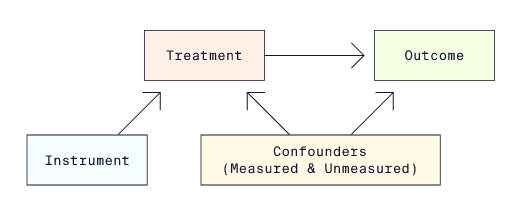

In this diagram, the arrows signify the presence and direction of a causal relationship. For example, there is no arrow directly from the instrument to the outcome because the instrument only impacts the outcome through its causal relationship with the treatment.

Each image has a different example of how IV estimation could be used in practice along with a causal diagram that describes the scenario. Pay particular attention to the third example, which describes the recycling scenario. We will use it throughout the rest of this lesson to illustrate IV estimation.

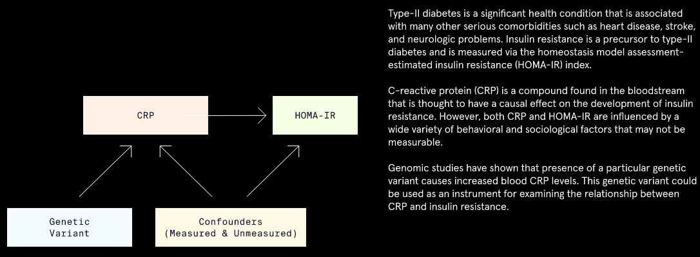

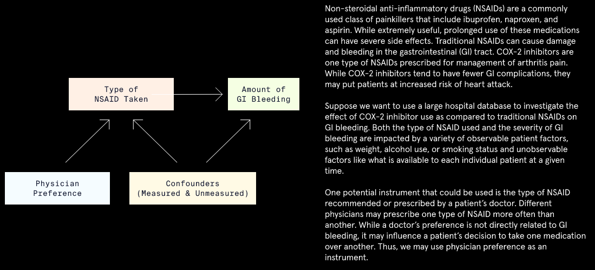

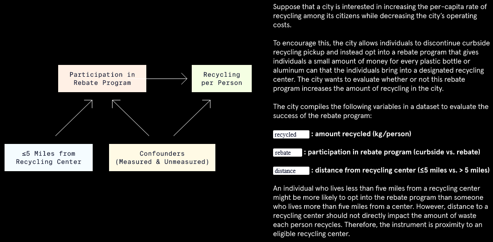

## Assignment vs Compliance

When treatment group assignments cannot be randomized due to ethical or practical reasons, the best we can do is to encourage compliance. However, encouragement does not guarantee compliance.

Compliance with the treatment assignment can be influenced by many factors, only some of which may be measurable. To account for unmeasured confounders of treatment compliance and the outcome, we could use IV estimation with treatment assignment as the instrument:

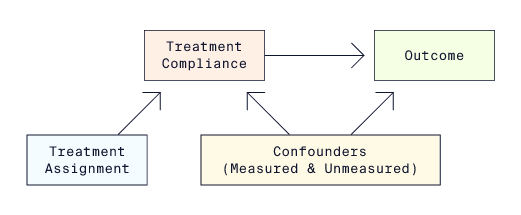

When the instrument AND treatment are both binary variables, we can define four types of “compliers”:

1.  *Always takers*: takes the treatment regardless of treatment assignment.
2.  *Never takers*: never takes the treatment regardless of treatment assignment.
3.  *Compliers*: takes the assigned treatment.
4.  *Defiers*: takes the opposite of the assigned treatment.

In the context of the recycling program example, the four types of compliers would be defined as follows:

|               | Instrument Value |                |
|---------------|------------------|----------------|
|               | **\<= 5 miles**  | **\> 5 miles** |
| Always takers | Rebate           | Rebate         |
| Never takers  | Curbside         | Curbside       |
| Compliers     | Rebate           | Curbside       |
| Defiers       | Curbside         | Rebate         |

The issue of compliance is related to the fundamental problem of causal inference, which states that we can never observe both potential outcomes. In an IV estimation, we can never observe both potential treatments received for an individual. Thus, we cannot know with certainty what kind of complier an individual is.

Fortunately, we can get around this issue by making additional assumptions about our sample.

| Treatment assignment | Treatment Received | Type of Compliance     |
|----------------------|--------------------|------------------------|
| Treatment            | Treatment          | Complier               |
| Treatment            | Control            | Never taker / Defier   |
| Control              | Treatment          | Defier                 |
| Control              | Control            | Complier / Never taker |

## Assumptions of IV Estimation

Compliance with the treatment assignment influences which causal estimand we calculate:

-   When compliance is perfect, the treatment assignment and treatment received can be used interchangeably to get an accurate estimate of the causal effect.
-   When compliance is NOT perfect, we cannot estimate the average treatment effect (ATE) because treatment assignment and treatment compliance are NOT interchangeable. Instead, the average effect of treatment assignment can be thought of as the effect of the *intention to treat*, or ITT effect.

IV estimation allows us to approximate the ATE by estimating a local average treatment effect (LATE) just among the compliers. This is known as the *compliers’ average causal effect* (CACE). To estimate the CACE, we must make four assumptions about the sample:

-   *Relevance*: the instrument has a causal effect on the treatment received.
-   *Exclusion*: the instrument affects the outcome ONLY indirectly through the treatment received.
-   *Exchangeability*: there are no confounders that influence both the instrument AND the outcome.
-   *Monotonicity*: there are no “defiers” in the sample.

The relevance assumption implies that there are no “never-takers” and “always-takers” in the sample. In these subgroups, the treatment received doesn’t depend on the value of the assigned treatment. And in order to estimate the treatment effect among the “compliers,” we must also assume that there are no “defiers” in the sample.

The images below contain more information about the assumptions, including diagrams showing violations of these assumptions.

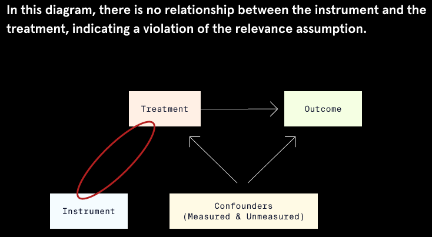

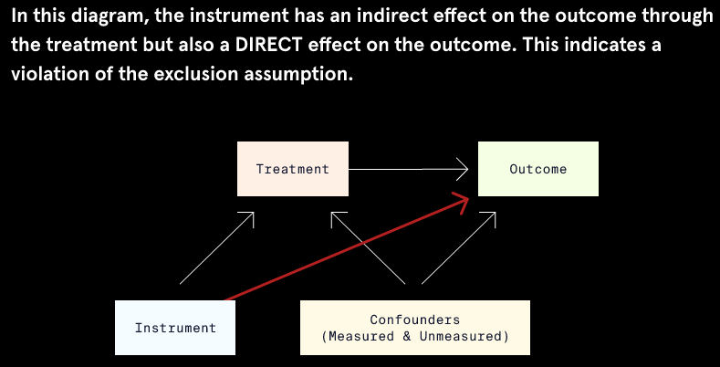

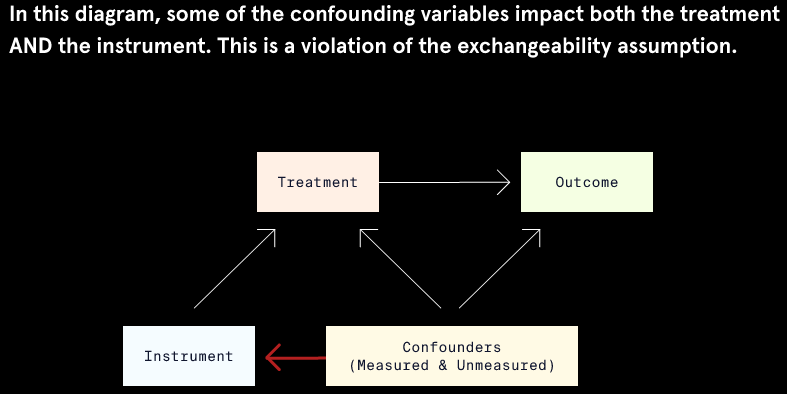

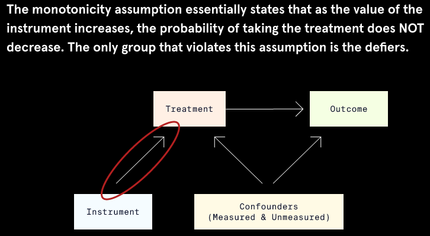

## Two-Stage Least Squares Regression

In a standard ordinary least squares (OLS) regression model, the outcome is predicted directly from the treatment assignment and other confounding variables. Such an OLS model would take the form:

**Outcome = β0 + β1 \* Treatment Assignment**.

In OLS regression, we would use β1 as an estimate of the treatment effect. To fit the OLS regression model using the recycling data, we would use the following code:

```
lm(recycled ~ rebate, #outcome ~ treatment
   data = recycle_df #dataset
)
 
# Output:
 
Call:
lm(formula = recycled ~ rebate, data = recycle_df)
 
Coefficients:
(Intercept)   rebate
  126.00       38.04
```

The OLS estimate suggests that participation in the rebate program leads to an average increase in recycling of 38.04 kilograms/person. However, this estimate is biased because OLS regression does not control bias introduced by unmeasured confounding variables or imperfect compliance.

In IV estimation, we account for unmeasured confounding variables and imperfect compliance via *two-stage least squares* (2SLS) regression. This type of regression predicts the outcome in two separate steps:

-   In the first stage, treatment received is predicted by the instrument (treatment assignment):

    **Predicted Treatment Received = α0 + α1 \* Treatment Assignment**

-   In the second stage, the outcome is predicted as a function of the predicted treatment received from the first stage:

    **Outcome = β0 + β1 \* Predicted Treatment Received**

β1 from the second stage of the 2SLS regression model is used as the estimate of the CACE.

In this lesson, we focus on 2SLS regression with a continuous outcome, binary instrument, and binary treatment to keep things simple. When this is the case, the first stage uses logistic regression, while the second stage uses linear regression.

## IV Estimation in R

Performing 2SLS in R is easy if we use the `ivreg()` function from the `AER` package.

The key difference in syntax between `ivreg()` and other regression functions is that the `formula` argument of the `ivreg()` function must include the instrument. If we wanted to perform 2SLS regression with variables `outcome` as the outcome, `treatment` as the treatment, and `instrument` as the instrument, the model formula would be `outcome ~ treatment | instrument`.

To fit the 2SLS regression using the recycling data, we would use the following code:

```
# import library
library(AER)
 
# run 2SLS regression
iv_mod <- ivreg(
  #outcome ~ treatment | instrument
  formula = recycled ~ rebate | distance, 
  data = recycle_df
  )
```

To view the coefficients and standard errors, we can use `summary(iv_mod)$coefficients`, which gives the following output:

```
             Estimate Std. Error   t value     Pr(>|t|)
(Intercept) 129.36463  0.8683141 148.98368 0.000000e+00
rebate       31.25452  1.4629239  21.36442 5.118885e-68
```

The results of 2SLS regression show that the estimate of the effect of the rebate program is 31.25, meaning participation in the rebate program led to an average increase in recycling of 31.25 kilograms/person. This only applies to compliers: those individuals who participated in the rebate program because they lived within 5 miles of a recycling center, but who would not have participated otherwise.

You may be wondering why we couldn’t just fit the two separate regression models described in the previous exercise using `lm()` or `glm()` functions. The `ivreg()` function is preferred because it automatically corrects standard errors to account for the fact that the second stage regression model uses predicted values of the treatment.

If we use incorrect standard errors, we could make incorrect conclusions about the treatment effect:

-   Lower standard errors correspond with more precise treatment effect estimates and a greater likelihood that the treatment coefficient will be found to be significantly different from zero.
-   Higher standard errors correspond with less precise treatment effect estimates and a lesser likelihood that the treatment coefficient will be found to be significantly different from zero.

## IV Estimation Interpretation and Considerations

While IV estimation can be effective in certain circumstances, it also has limitations. One limitation is that the causal estimand (CACE) is not generalizable. The CACE only describes the effect of those who comply with treatment.

Another limitation is that it is difficult to find a suitable instrument that has a strong relationship with the treatment. If an instrument is only weakly related to the treatment, 2SLS regression will produce inaccurate estimates of the CACE.

To illustrate this, suppose that instead of using distance as an instrument for participation in the rebate program, we used another variable, `children`. The variable indicates whether or not an individual has children. Having children wouldn’t directly cause a change in recycling, but individuals with children might be less likely to participate in the rebate program. The rebate program requires individuals to take the time to drop off recycling — time that people with children might not have.

Performing the 2SLS regression again with the `ivreg()` function and the `children` variable as an instrument highlights the effect of using a weak instrument:

```
iv_mod_weak <- ivreg(
  formula = recycled ~ rebate | children, #new weak instrument
  data = recycle_df
  )
Using summary(iv_mod_weak)$coefficients we can view just the coefficient table from the results summary.
             Estimate Std. Error   t value     Pr(>|t|)
(Intercept) 126.10140   8.930242 14.120715 5.477652e-37
rebate       37.84692  18.018181  2.100485 3.631487e-02
```

The estimate of 37.85 is neither accurate nor precise, as highlighted by the large standard error. This estimate is similar to the estimate from OLS regression, demonstrating that this is a weak instrument.

## Conclusion

We covered a lot of topics:

-   Instrumental variable (IV) estimation is a causal inference technique that can be used to estimate a causal treatment effect even in the presence of unobserved confounding variables.
-   IV estimation can be used in non-randomized studies when compliance with the assigned or encouraged treatment is not perfect.
-   An instrument is a variable that is related to an outcome of interest ONLY through the treatment variable.
-   The four assumptions of IV estimation are relevance, exclusion, exchangeability, and monotonicity.
-   IV estimation is performed via two-stage least squares (2SLS) regression.
-   The `ivreg()` function in the `AER` package performs 2SLS regression and automatically provides corrected standard errors of the treatment effect.

Great job! The 2SLS regression model using the email campaign as an instrument produced a CACE estimate of 38.056. As long as our assumptions hold, this means that using video streaming services increased spending by an average of about 38 dollars. Since this is the CACE, it only applies to compliers: those who used the streaming services because they received the email, but who would not have used streaming otherwise.

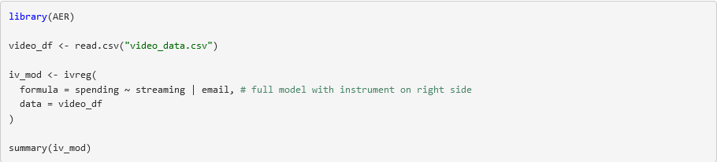

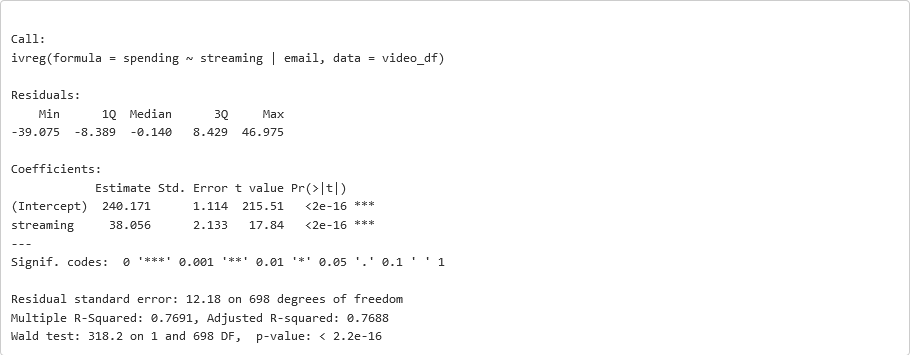
