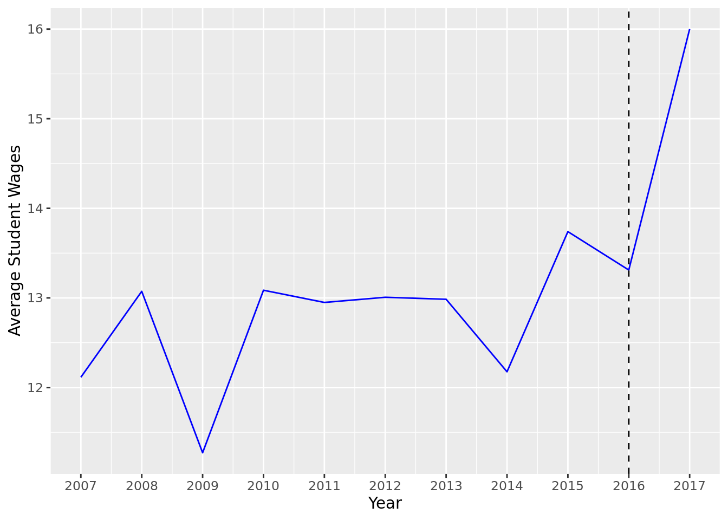
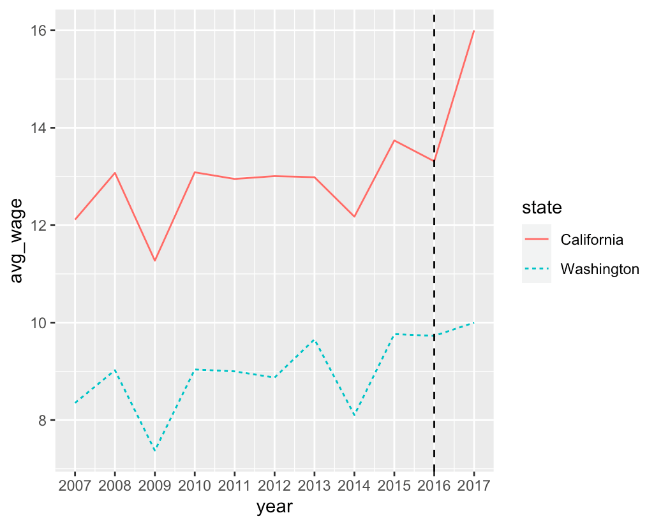
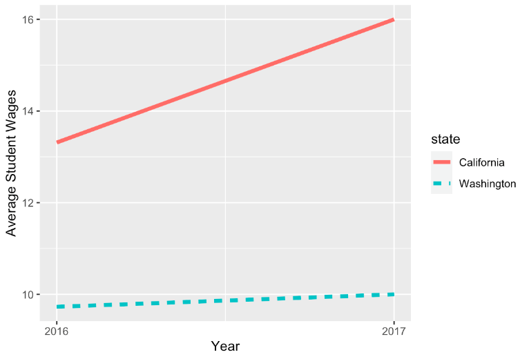
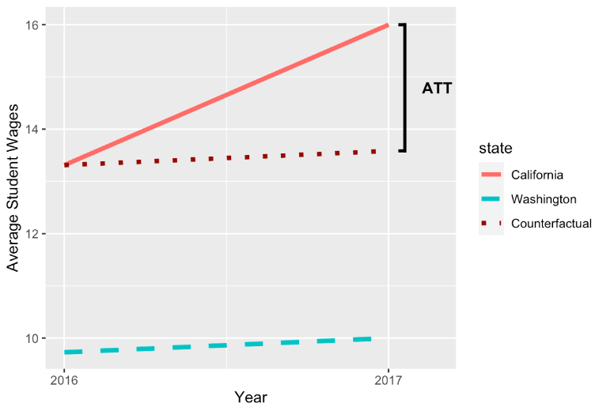

# Difference in Differences (DiD) for Causal Inference

## Introduction

Imagine that a California state law was passed in 2016 that raised the minimum wage beginning in the year 2017. We are interested in what this law’s impact has been on student wages since student jobs often pay low wages.

We have the data on the average student wages at all California public universities from the year 2007 to 2017, displayed in the plot below. We note that wages rise and fall from year to year, but we see a particularly large rise from 2016 to 2017.



It’s easy to assume the large increase was entirely due to the new minimum wage law. But what would average student wages in 2017 have looked like had the law NOT been passed?

-   Would wages still have increased a lot, meaning the law had little impact?
-   Would wages have decreased, meaning the law had an even larger impact than just the difference between 2016 and 2017 wages?

The fundamental principle of causal inference tells us that we can’t observe both situations, so we need to use other observed data as a substitute for what student wages in California would have looked like in 2017 had the law not passed.

Difference in differences (DID) is a causal inference technique that estimates a treatment effect by analyzing treatment and control trends over time. In the following exercises, we will walk through how to apply DID to our student wage example, review the different assumptions and limitations of the DID method, and learn how to perform this method using R programming.

## Working Example

Let’s say we have some data on student wages at the state level in a dataset called `wages`. It has the following variables:

-   `state`: state where the universities are located
-   `year`: year the data is from
-   `avg_wage`: average student wage for all public universities in the state

Start by using the package ggplot2 in R to re-create the student wage line plot from the last exercise. Since we only want to plot California schools, filter by the `state` variable and then add code for our plot.

```
# import libraries
library(dplyr)
library(ggplot2)
# plot wages versus years
ca_wages <- wages %>%
  #only California schools
  filter(state == "California") %>% 
  #wages over time
  ggplot(aes(x = year, y = avg_wage)) + 
  #line plot
  geom_line()
```

The situation created by the law is a *natural experiment*. Rather than having a researcher randomly assign treatment and control groups to study minimum wage effects, treatment assignment is decided by some outside force. In this case, that outside force was the minimum wage law that went into effect in 2017.

Let’s add a dashed vertical line to our plot to separate the time before and after the law went into effect. We’ll also label the x-axis scale to see the years more clearly.

```
ca_wages +
  geom_vline(xintercept = 2016, linetype = "dashed") +
  scale_x_continuous(breaks = c(2007:2017))
```


We can see that there is some change after the law is implemented in 2016, but we don’t know if the change is due to the law or because of other conditions that happened at the same time. We need some data to use as a counterfactual to this situation: what student wages in California would have looked like if the law never happened.

## Finding a Control Group

It is impossible to know what truly would have happened in California schools if the law had never happened. However, we can look for another state whose average student wages that follow a similar pattern over time — but did not receive the same treatment. We can use the other state’s data to approximate the counterfactual. With DID, we use the *trend* of a control group to estimate the counterfactual trend for the treated. In other words, we use DID to estimate the average treatment effect on the treated (ATT).

In this example, a control trend might be the average student wage of universities in Washington, given that Washington did not implement a new minimum wage law. We can view these two groups in a single plot using the following code:

```
# import library
library(ggplot2)
# plot wages versus years by state
ggplot(data = wages, aes(x = year, y = avg_wage, color = state, linetype = state)) +
  geom_line() +
  #vertical line at 2016
  geom_vline(xintercept = 2016, linetype = "dashed") +
  #x-axis scale 2007 to 2017
  scale_x_continuous(breaks = c(2007:2017))
```



We can see that in the years leading up to 2016, the average minimum wage at Washington colleges followed a very similar pattern to the California colleges, only shifted lower. We hope that these similar patterns account for other important variables, such as the impact on wages of living costs and necessary student expenses.

## Assumptions

We noted that Toronto may be a good control group for Sydney because the trends in ticket sales follow a similar pattern. This is actually a necessity of DID called the *parallel trends* assumption: trends between the control and treatment groups should be similar prior to the start of treatment.

The specific values between groups do not need to be the same, but the two groups should have the same change over time. We can check this visually by plotting the data by group and verifying that the general trends are similar, as we saw in the previous exercise. A disadvantage to DID is the difficulty of meeting the parallel trends assumption: we need pre-treatment data for both groups AND the data has to show similar trends before treatment.

Another assumption for DID is that the treatment group was selected for the treatment by a factor that is independent of the outcome. This assumption is met for our example: the treatment is determined by state, which is independent of the overall average student wages.

Finally, the assumptions for DID also include the normal assumptions for all causal inference methods:

-   Conditional exchangeability
-   Stable Unit Treatment Value Assumption (SUTVA)
-   Overlap

The plot below shows the ticket sales data from the previous exercise. Take a look at the lines for Toronto and Sydney covering the time from 2012 to 2018, just before the new tax was implemented. Both lines follow a similar trend going up and down slightly each year but with a particular dip in 2016.

Do you think Toronto will make a good approximation of Sydney’s counterfactual even though its line is lower on the plot?

Do you think we’ve met the other assumptions of DID in this case?


## The 2x2 Case

Normally we would want to use all the data we have available to us to perform our DID model. However, that type of analysis can be complex. To keep things simple, we are going to focus on a 2x2 analysis for our student wage data, which means we will look at differences in average wages from the year before the law went into effect (2016) and the year after (2017).

From this plot, we see that the Washington schools had a much smaller increase in average student wages from 2016 to 2017 than the California schools did. We assume that if the law had NOT been passed, the pattern of student wages for the California schools would have been similar to the pattern of wages for the Washington schools. In other words, we assume the slope of the California wages would be the same as that of the Washington wages, as illustrated by the dotted red line in the following plot.



With this new line based on Washington’s pattern, we have drawn our approximation of California’s counterfactual trend. The difference between California’s 2017 observed wages and its 2017 counterfactual wages will be our estimated ATT, as shown in the plot. In the next exercises, we will compute this treatment effect using the approximated counterfactual trend in two ways.

## Estimate Using Difference in Means

One way we can estimate the ATT is by comparing the differences in average wages over both time and treatment groups.

Let’s view the mean wages for both states for 2016 and 2017 only.

```
# import library
library(dplyr)
# filter data
wages %>% 
  filter(year > 2015) #only 2016 and 2017

The output looks like the following:
       state year  avg_wage
1 California 2016 13.311279
2 California 2017 16.000000
3 Washington 2016  9.728146
4 Washington 2017 10.000000
```

First, let’s use the means in our output to take the difference in average wages before and after the law for each state.

**California**

mean2017 - mean2016 = \$16.00 - \$13.31 = \$2.69

**Washington**

mean2017 - mean2016 = \$10.00 - \$9.73 = \$0.27

Hypothetically, if the law had no effect on wages, we would expect the difference between the post-treatment mean and the pre-treatment mean for the treatment group would be similar to the difference for the control group. However, these findings match what we saw in our plots before: California experienced a MUCH LARGER change in average wages from 2016 to 2017 than Washington did.

But how much of that California change was due to factors other than the new law? We answer this question by taking the difference of the differences we just found — which is where this method gets its name!

ATT = differenceCalifornia - differenceWashington

ATT = \$2.69 - \$0.27

ATT = \$2.42

According to our basic 2x2 DID that uses mean differences alone, we estimate the average treatment effect on the treated to be \$2.42. But there’s still another DID method we might want to try!

## Estimate Using Linear Regression

While we were able to estimate the ATT through mean differences alone, we can also use linear regression for DID. A simple DID regression model predicts the outcome from the variables for treatment group and time, along with the interaction of treatment with time.

To simplify our output, we will first transform the `state` variable to a treatment indicator called `treat` (1 for California and 0 for Washington). Then we transform `year` to a time indicator called `time` (1 for 2017 and 0 for 2016).

```
# transform state to treat
wages2$treat <- ifelse(wages2$state=="California",1,0)
# transform year to time
wages2$time <- ifelse(wages2$year==2017,1,0)
```

We can print and inspect our dataset to make sure our transformations were done correctly.

```
       state treat year time  avg_wage
1 California     1 2016    0 13.311279
2 California     1 2017    1 16.000000
3 Washington     0 2016    0  9.728146
4 Washington     0 2017    1 10.000000
```

To create a DID regression for our student wage data, we run a model that predicts average student wages from the treatment, time, and the interaction of treatment and time. Note that in R, `treat*time` is equivalent to `treat + time + treat:time`.

```
did_mod <- lm(
  #include interaction
  avg_wage ~ treat*year,
  #use subsetted data 
  data = wages2 
)
```

When we print `did_mod` we get the following output. Note that the coefficient on the interaction term `treat:year` is exactly what we computed for the ATT by taking the difference of means. We estimate the impact of the minimum wage law on California student wages to be an increase of about \$2.42.

```
Call:
lm(formula = avg_wage ~ treat * time, data = wages2)
 
Coefficients:
(Intercept)        treat         time   treat:time  
     9.7281       3.5831       0.2719       2.4169
```

What do all the other coefficients represent?

-   `Intercept` indicates the expected value for pre-treatment average student wages for the control group (Washington 2016).
-   `treat` is the difference between the control group and the treatment group at the pre-treatment time (California 2016 - Washington 2016).
-   `time` is the difference between the pre-treatment and post-treatment times for the control group (Washington 2017 - Washington 2016).

Combinations of these coefficients give us back all four means from our dataset.

| Mean            | Equivalent Coefficient(s)             |
|-----------------|---------------------------------------|
| Washington 2016 | Intercept                             |
| California 2016 | Intercept + treat                     |
| Washington 2017 | Intercept + time                      |
| California 2017 | Intercept + treat + time + treat:time |

## Review

You’ve completed a lesson on the fundamentals of difference in differences for causal inference. Through applied exercises you learned:

-   DID uses the trend of a control group as an approximate counterfactual trend for the treatment group.
-   DID requires that we have pre-treatment data for both groups and that we meet the parallel trends assumption.
-   We can compute the ATT by taking mean differences or through linear regression.

You may be wondering why we would use linear regression at all when we can just use means. Regression allows us to control for confounding variables as well as get estimated standard errors. We explored simple models in this lesson to get a strong foundation, but more complex DID analyses benefit from the added flexibility of regression modelling.
