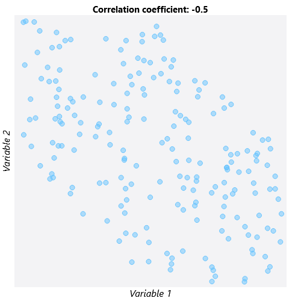
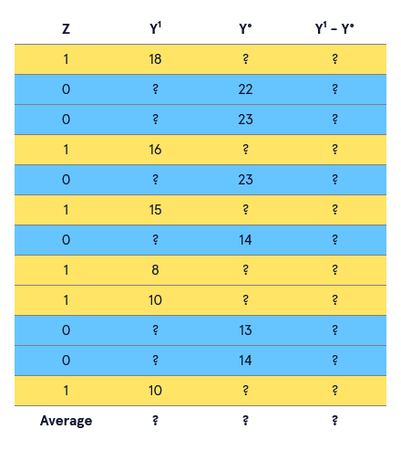
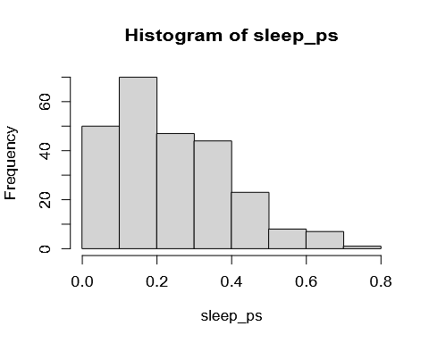
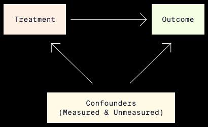
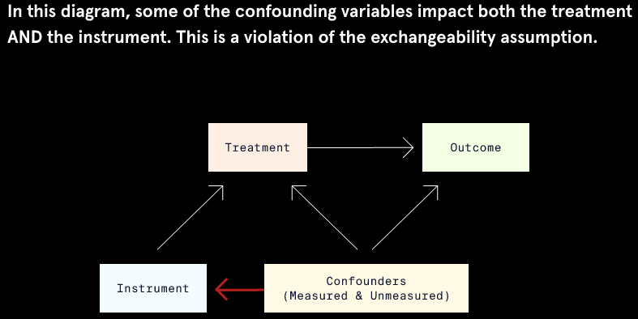
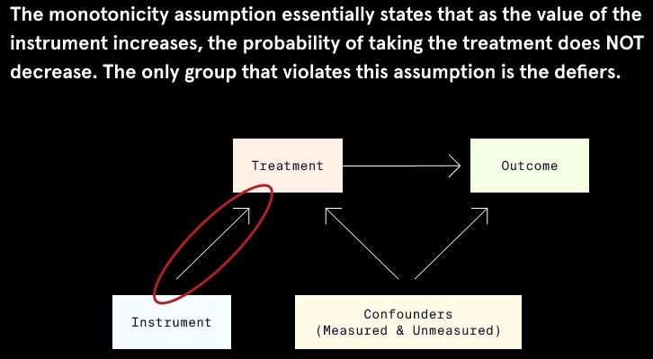
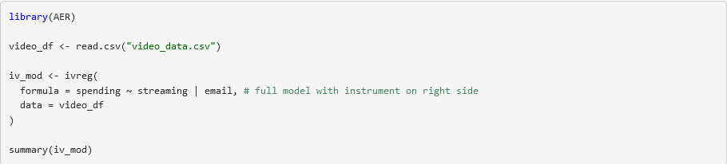
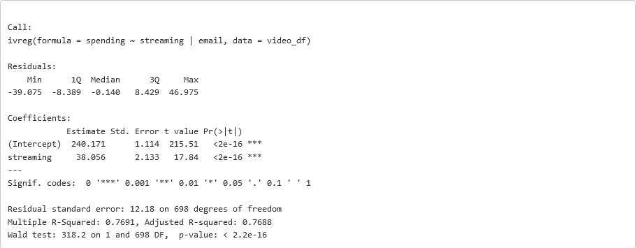

# Conceptual Foundations of Causal Inference – Potential Outcomes Framework

## Introduction

As humans, we are hardwired to look for patterns and identify relationships between things we observe in the world around us. Our brains naturally tend to fill in details and come up with explanations for these relationships. Unfortunately, jumping to conclusions often leads us to see non-random in the random and to blur the lines between association and causation.

Before we get some hands-on experience using causal inference methods, we need to build up some intuition about what exactly causal inference is, when causal inference is appropriate to use, and what causal inference can (and cannot) do. In this lesson, we will gradually introduce you to the key ideas, statistical frameworks, and required assumptions that are fundamental to causal inference.


## Correlation is NOT Causation


Chances are, you or someone you know is superstitious to some extent. Whether it’s wearing a lucky t-shirt to a sporting event or using a favorite pencil and eraser on exams, we believe in superstitions because we think our actions will lead to some desired—but usually unrelated—result. Superstitions are, in fact, extreme examples of assuming an associational relationship is actually causal in nature.

One of the most important concepts in causal inference is the distinction between association and causation. Let’s formally define these two terms:

1.  *Association* is a general term to describe a relationship between variables. Association can describe the strength or pattern of a relationship, but it does not explain the mechanism behind the relationship.

    One frequently used statistical measure of association is *correlation*. Correlation is typically used to describe the association between two variables with a linear pattern. The images below show what variables with different degrees of correlation look like.



1.  *Causation* describes not only the strength or pattern of a relationship but also the MECHANISM of a relationship. In a causal relationship, variable X CAUSES a change in variable Y; we know that X must happen before Y.

## Thinking Counterfactually

The second important concept we must learn is *counterfactual thinking*. Counterfactual thinking is the process of asking, “What WOULD have happened if circumstances were different?” Let’s illustrate counterfactual thinking using the following example:

Dogs are often called “human’s best friend,” but did you know there may be a biological explanation behind this saying? Research has shown that just a few minutes of interacting with dogs or cats can reduce levels of cortisol, a hormone linked to stress that may lead to weight gain or a weakened immune system. Let’s say we’re interested in learning whether interacting with a trained therapy animal leads to decreased levels of cortisol in hospital patients.

Approaching this using counterfactual thinking, we must consider what each patient’s cortisol level would be in two different “universes”:

-   In one universe, a patient interacts with a therapy animal—we will call this “Universe T.”
-   In the other universe, referred to as “Universe C,” the same patient does NOT interact with a therapy animal.

The cortisol levels in these two parallel universes are called *potential outcomes* because either could potentially be observed. But in reality, we can only observe one cortisol level for a particular patient at one specific moment in time.

Assume that a patient exists in Universe T and ACTUALLY interacted with a therapy animal. The cortisol level observed in this scenario is the *observed* or *factual outcome* because it is the outcome that was observed. The cortisol level that would have been observed if the patient existed in Universe C and did not interact with the therapy animal would be the *counterfactual outcome*. We can never actually observe the counterfactual outcome.

Using counterfactual thinking allows us to compare the exact same person at the exact same time under two different circumstances. Because the only difference between the two universes is that the patient received the treatment in Universe T and the control in Universe C, we could compare the cortisol levels from each universe to get an estimate of the effect of interacting with therapy animals.

The two images below illustrate which outcome is the factual outcome and which is the counterfactual outcome when universe T and universe C are true. When the individual is actually in universe T, the cortisol level observed in universe T is the factual outcome and the cortisol level observed in universe C is the counterfactual outcome. If the individual is actually in universe C, the reverse is true.

 

## Potential Outcomes Notation

In order to generalize our understanding of the potential outcomes framework, we will now introduce some notation that will be used throughout the rest of this course.

-   Z represents the treatment or exposure condition. When Z is binary, there are only two possible treatment conditions: treatment (Z = 1) or control (Z = 0).

    (Z could also be a continuous variable, such as medication dosage or number of days in the hospital, but our example assumes that there are only two treatment conditions for simplicity.)

-   Y represents the observed value of the outcome variable.

In the potential outcomes framework, we consider how the Y values we observe would change if the treatment were different:

-   When Z is binary, the two potential outcomes are represented with Y1 and Y0:
    -   Y1 is the potential outcome under the treatment condition (Z = 1).
    -   Y0 is the potential outcome under the control condition (Z = 0).

In real life, an individual can only be in one treatment group at any specific point in time. Thus, we can never know the value of both potential outcomes for an individual. We will discuss how to deal with this problem in future exercises. For now, assume that we could know the values of both Y0 and Y1.

## A Missing Data Problem

If we knew both potential observations for every individual, we could use them to estimate several different statistics that summarize the effect of the treatment:

-   The *individual treatment effect* (ITE) is computed as Y1 - Y0. This statistic directly compares the two potential outcomes for each individual.
-   The *Average Treatment Effect* (ATE) is the average of all individual treatment effects, which can be calculated as the difference between the average of Y1 and the average of Y0.

Hold up! You may be wondering, “How are we supposed to calculate the individual treatment effect or true ATE if we can never observe the counterfactual outcome?” This question gets at the fundamental problem of causal inference. Causal inference is essentially a missing data problem: since we can only observe the outcome that actually happened, we are always missing the counterfactual outcome.

The tables below show data for 12 hospital patients who either interacted with a therapy animal (Z = 1) or did not interact with a therapy animal (Z = 0). “Theoretical” refers to the theoretical data unobservable in real life and “Reality” refers to what we could actually observe from these 12 patients in reality.

The theoretical data contains both potential outcomes. Because we have both potential outcomes, we can compute the true ATE by subtracting the potential outcome averages. The true ATE is -5.8, which means that interaction with therapy animals results in an average decrease in cortisol levels of 5.8 units.

The real data contains only one potential outcome for each individual. Notice now that the Y1 values are missing for individuals in the control group (Z = 0), and the Y0 values are missing for individuals in the treatment group (Z = 1). In real life, we will always be missing half of the data we need to calculate the true ATE.

**Theoretical   Reality**

 

## Estimating the ATE

Because we can never know both potential outcomes for an individual, we need to use a different method to estimate causal effects. The most accurate way to do this is to use *randomization*.

Randomization is a method of treatment group assignment that is essentially a coin flip to determine whether an individual receives the treatment or the control. This ensures that, for a large enough sample size, the treatment groups will be similar on average with respect to all factors EXCEPT for the treatment condition. While we still won’t know the counterfactual outcome for any individual, we can be reasonably confident that similar individuals received each treatment. This allows us to estimate the potential outcomes we weren’t able to observe.

When randomization is possible, we can estimate the ATE by taking the difference of the average observed outcome values in the treatment and control groups. In the example, the estimated ATE equals -5.4, which is very close to the true ATE of -5.8 that was calculated in the previous exercise.


## Confounders and Selection Bias

Often, randomization of treatment is unethical. For example, it would be unethical to force hospital patients who don’t like animals to receive therapy animal services. Randomized experiments can also be expensive and demand a lot of resources. It is often more practical to use data that is already available. In these scenarios, the treatment group is not random but is based on other factors, such as personal preference.

When randomization is not possible or plausible, several sources of bias can impact the accuracy of estimated causal effects. One source of bias is *selection bias*. Selection bias is bias that happens because of how individuals were put into the treatment or control groups.

In terms of our therapy animal example, selection bias might arise if:

-   individuals choose whether they want the therapy (dog-lovers might be over-represented in this case)
-   individuals in the control group come from a different hospital
-   individuals are only able to receive the therapy based on another variable, such as insurance coverage

If any of these variables that are associated with treatment assignment are also related to the outcome variable (cortisol level), they are considered *confounders*, or *confounding variables*. These variables may lead us to incorrect conclusions about the impact of the treatment on the outcome.

The following is a graphical representation of how the confounder X is associated with both the treatment Z and outcome Y:


To illustrate the concept of confounding variables, consider the following example. Suppose we are interested in learning about the effect of coffee on blood pressure. If we assume that there are no confounding variables impacting coffee intake or blood pressure, the causal relationship would look something like the first diagram where drinking coffee and high blood pressure are linked by a single arrow.


Assuming that there are no confounders that are related to both coffee intake and blood pressure is unrealistic from a scientific perspective. We know that people who smoke cigarettes tend to drink more coffee than people who do not. We also know that nicotine in cigarettes is associated with higher blood pressure. Therefore, it is reasonable to conclude that cigarette smoking is a potential confounder in the relationship between coffee intake and blood pressure. In our diagram, we add smoking cigarettes as a confounder that points to both drinking coffee and high blood pressure.


## Estimating the ATE with Confounders

So how do we deal with confounders and estimate the ATE when the treatment assignment is not randomized? Let’s return to the therapy animal example once more.

Suppose that instead of randomizing patients to receive therapy animal services, we allow the twelve hospital patients to CHOOSE whether or not they want therapy. Imagine that we also have data for a new confounding variable X that represents whether an individual does (X = 1) or does not (X = 0) have a diagnosis of anxiety disorder. Here, X is a confounder and impacts both the treatment and the outcome: patients who have anxiety might be more likely to choose to receive therapy animal services AND have higher cortisol levels generally.

This confounding is problematic because it means there may be more people with anxiety in the treatment group than in the control group. More people with anxiety means the treatment group may have a higher average cortisol level compared to that of the control group before therapy animal services even occur!

When the treatment groups are unbalanced with respect to confounders, the treatment groups are not *exchangeable*: we would observe different outcomes if the treatment groups swapped treatment conditions.

To avoid making poor comparisons between potentially imbalanced treatment groups, we have to be able to assume *conditional exchangeablility*:

-   *Conditional exchangeability* means that the treatment groups are exchangeable if we take into account confounding variables.
-   This is also called *ignorability* or *unconfoundedness*.

By taking anxiety diagnosis (variable X) into account, we avoid getting a biased estimate of the cortisol levels produced by those receiving therapy animal services in comparison to those who do not.

The following example shows how the anxiety confounder might bias our estimate of the treatment effect in our therapy animal analysis.

**Non-randomised treatment ignoring X**

In our table, we have the data for our twelve hospital patients who chose whether or not to receive therapy animal services. The variables include anxiety diagnosis (X=1 for anxiety and X=0 for no anxiety) and treatment assignment (Z=1 for therapy and Z=0 for no therapy). Because this is reality, we cannot see both potential outcomes but rather just the observed outcome Y (observed cortisol level).

If we compute the estimated ATE as though treatment was randomized and don’t take anxiety (X) into account, we get an estimated ATE of -2.9. We conclude that therapy animal services reduce cortisol levels by 2.9 units on average.


**Estimated ATE for X=1**

In order to account for the anxiety variable, we first compute the ATE for just those patients diagnosed with anxiety disorder (X=1). We do this as we always do: by subtracting the average cortisol level for the control patients from the average for the treated patients. Because we are only comparing patients with anxiety, the groups should theoretically have similar cortisol levels before receiving therapy. We find an estimated ATE of -5.5 for individuals with anxiety—much greater in magnitude than our initial estimate of -2.9.

****

**Estimated ATE for X=0**

Now we compute the ATE for just those patients NOT diagnosed with anxiety disorder (X=0). We find an estimated ATE of -5.5 for individuals WITHOUT anxiety.

****

**Comparison of ATE effects**

Averaging the ATEs of our two groups gives us an estimated ATE of -5.5 when we take X into account. If we recall from Exercise 5, the true ATE was -5.8: therapy animal services reduced cortisol levels by 5.8 units on average. Our estimate when we took confounding into account was much closer to the true treatment effect.

Why did this happen? Anxiety correlated with higher cortisol, and more people with anxiety were in the treatment group. This made the treatment group’s cortisol levels tend toward higher levels, making it look as though therapy animal services were not bringing down cortisol levels by much.


## Assumptions

The last exercise brought up one assumption used throughout causal inference: conditional exchangeability. In this lesson, we will learn a few more assumptions.

A second assumption made in causal inference is *Stable Unit Treatment Value Assumption* (SUTVA). The name is a mouthful, but it’s a pretty simple assumption that can be broken down into two components:

1.  An individual’s treatment assignment doesn’t impact the outcome of other individuals. Using the example of the hospital patients, this would mean that one individual getting therapy animal services doesn’t impact the stress level of other individuals in the hospital.
2.  The treatment (or control) is applied exactly the same way to all patients. For example, the patients receiving therapy animal services should receive therapy for the same amount of time and ideally from the same exact animal to ensure consistent treatment.

The next assumption we need to familiarize ourselves with is *overlap*. The assumption of overlap means that all subgroups of patients divided by their characteristics have a positive, non-zero probability of getting either treatment assignment. Overlap is also referred to as the *common support* or *positivity* assumption.


The left half of the plot shows an example of when the assumption of overlap is met. For individuals of all ages, there is a positive probability of being assigned to either the treatment or control group. No age has a 100% probability of being assigned to treatment and a 0% probability of being in the control group or vice versa. The area of overlap is called the *region of common support*.

In contrast, the right half of the plot shows when the assumption of overlap is NOT met.

-   Patients under the age of about 38 have zero probability of being assigned to the control group.
-   Patients above the age of 38 have no probability of being assigned to the treatment group.

If we try to make inferences based on the groups with no overlap, we are comparing a group of treated younger individuals to a group of untreated older individuals. We cannot reasonably assume age does not also affect our outcome.

## Other Causal Estimands

So far, we’ve only focused on the ATE, but there are many other useful estimands we can use to summarize the average causal effect of some intervention or exposure. In many situations, it is not realistic to meet the assumptions of conditional exchangeability, SUTVA, AND overlap. Other causal estimands allow us to relax some of these assumptions.

The ATE summarizes the causal effect of treatment across ALL treatment conditions. But, we may only be interested in the causal effect of treatment in a particular group. In these cases, we can use a different estimand:

-   *Average Treatment Effect of the Treated* (ATT) is the average of Y1 - Y0 for all individuals assigned to the treatment condition (Z = 1).
-   *Average Treatment Effect of the Control* (ATC) is the average of Y1 - Y0 for all individuals assigned to the control condition (Z = 0).

There are other estimands we may encounter in causal methods, but the ATE, ATT, and ATC are three that we see in a variety of situations.

The table shows theoretical data as well as which subsets of that data we use to calculate the ATT and ATC. Here, because the data is theoretical, we have both the factual and counterfactual outcomes for each individual, so we can compute both the ATT and the ATC.


## Causal Inference Process

Now that you have some experience with the assumptions needed for causal inference as well as familiarity with a few causal estimands, we need to set up a structured way to apply what you’ve learned when approaching causal inference problems.

We can think of causal inference as a two-step process.

1.  *Identification:* During this stage we determine which causal estimand we will estimate based both on what we want to know and on what we are able to compute. We must also determine whether we will be able to meet the three assumptions in order to infer that the relationship is causal in nature.
2.  *Estimation:* Now that we’ve reasoned what can compute and that this measure will reflect a causal relationship between variables, we must carry out the statistical model to compute the treatment effect. We used some simple computations throughout this lesson, but we will soon use more complicated methods like multiple linear regression to obtain our estimand.


The flowchart summarizes the two steps in the causal inference process: Identification and Estimation. Think about these steps as we would have applied them in our therapy animal example.

**  
**

**Identification**

-   *Estimand:* Are we interested in computing the ATE for all patients, or do we only care about the effect of therapy animals on the patients who were treated (ATT)? Are we able to compute the ATE in this case? When might we NOT be able to compute the ATE?
-   *Assumptions:*
1.  *Conditional Exchangeability:* Are the treatment and control groups exchangeable? Or do we need to account for other measures of confounding beyond just anxiety diagnosis?
2.  *SUTVA:* Does one patient receiving the therapy influence other patients to choose to receive the therapy? Is every patient receiving the same services (same frequency, same amount of time, same kind of animal)?
3.  *Overlap:* Does every patient have some probability of being in either therapy group? Or do some types of patients have no probability of being treated, such as those with allergies or those under age 18?

**Estimation**

-   Which statistical model will we use to estimate the treatment effect?
-   Are there any additional assumptions that need to be met to use this technique?

## Review

In this lesson, you learned:

-   Causation is different from association in that it implies a relationship where a change in one variable leads to a change in another variable.
-   If we could view both potential outcomes, we could accurately compute the true effect of a treatment.
-   The fundamental problem of causal inference is that we only get to view the observed outcome and not its counterfactual.
-   When randomization is not available to produce estimates of treatment effects, we must use other strategies to predict counterfactuals and find our estimand of interest.
-   The three main assumptions for causal inference are:
    -   Conditional exchangeability
    -   SUTVA
    -   Overlap
-   The causal inference process can be thought of as two steps: identification and estimation.


# Matching and Weighting Methods – Propensity Scores

## What are Propensity Scores?

One of the main assumptions in causal inference is known as the assumption of *conditional exchangeability*. This assumption states that, so long as we account for confounders (the non-treatment, non-outcome variables), we would observe the same outcomes if the treatment and non-treatment groups were swapped. Conditional exchangeability is achieved via randomization since it balances both observed AND unobserved variables between treatment groups. However, conditional exchangeability can be difficult to achieve in non-randomized situations.

Propensity score methods are widely used in causal inference because they can help reach conditional exchangeability even when randomization is not possible. So what are propensity scores, and how can we apply propensity score methods to our own questions?

A *propensity score* is essentially the probability of being in a particular treatment group given a set of observed variables. Typically we will think of propensity scores as the probability of being in the treatment group as opposed to the control group. In a sense, propensity scores summarize all the traits of an observation to a single score, which can be an advantage when there are lots of observed variables.

Propensity score analyses can be broken down into five ordered steps:

1.  Check initial overlap and balance.
2.  Model propensity scores.
3.  Use propensity scores to weight the dataset.
4.  Re-check overlap and balance.
5.  Estimate the treatment effect, or return to step two to improve the propensity score model.


## Variable Overlap and Balance

The first step in a propensity score analysis is to check how similar the treatment and control groups are at baseline, before using propensity score methods. There are two measures that are commonly used to describe the degree of similarity between treatment groups: *overlap* and *balance*.

-   *Overlap* is the range of values of a variable that the treatment and control groups have in common.
    -   *Overlap* can also be thought of as the range of values of a variable where the probability of being in the treatment group is greater than 0 but less than 1.
    -   We already know that overlap is an important assumption of causal inference!
-   *Balance* describes how similar the treatment and control groups are with respect to the entire distribution of each of the other variables.
-   Balance is expressed as a statistic that summarizes the entire distribution of a variable. Two statistics are commonly used to measure balance.
1.  *Standardized mean difference* (SMD). The SMD of a variable in a sample is defined as the difference in the average value of the variable between groups divided by the standard deviation of the variable in both groups.
2.  *Variance ratio*. The variance ratio of a variable in a sample is the variance of the variable in one treatment group divided by the variance of the variable in the other treatment group.

So how is “good” or “bad” balance defined?

-   An SMD close to zero indicates good balance. This means the average value (and thus the center of the distribution) of the variable is similar between the treatment and control groups.
-   A variance ratio close to one is another indicator of good balance. This means that the variability, or spread, of the variable is the same in both groups.

## Visual Check of Numeric Variables

Suppose we are interested in determining whether the practice of meditation increases the amount of sleep that university students get per night. To gather more information, we surveyed 250 students about their sleeping and meditation habits over the previous year. Note that students were not randomly assigned to treatment groups; students were simply asked about their actions. Their responses were recorded in a dataset with these variables:

-   `sleep` — average hours of sleep per night (outcome variable)
-   `meditate` — indicates whether or not the individual reports consistent use of meditation (treatment group variable)
-   `stress` — a self-reported measure of stress on a 1-to-100 scale, with 1 representing no stress and 100 representing extremely high stress
-   `graduate` — indicates whether or not a student is in a graduate program versus an undergraduate program (0 = undergraduate; 1 = graduate).

We can use the `bal.plot()` function from the R package, cobalt, to visually check if any variables are severely imbalanced and whether propensity score methods might be useful. The function takes a formula where the left side specifies the treatment group indicator and the right side includes a variable we want to view. To check the `stress` variable, the formula would be `meditate ~ stress`. Then we specify the dataset name and the variable of interest in quotes as additional arguments.

```
# import library
library(cobalt)
# plot distributions for stress variable
bal.plot(
  x = meditate ~ stress, #formula
  data = sleep_data, #dataset
  var.name = "stress" #variable
  colors = c("#E69F00", "#009E73") #set fill colors
)
```

Note that we also set the optional argument `colors` to c("\#E69F00", "\#009E73") for better contrast.


The distributions in the plot appear to differ pretty substantially between the treatment groups, potentially indicating poor balance. The meditation group (green) is centered around a score of 40 with a narrow spread, while the non-meditation group (orange) is centered around 55 with a much wider spread of stress scores.

## Visual Check of Categorical Variables

Distribution plots are great for numeric variables, but we need a different type of plot for categorical variables. Fortunately, we can use the exact same `bal.plot()` function from cobalt with no need to specify the variable type. By updating the arguments for `x` and `var.name` to use `graduate`, we will get a bar plot to examine balance for the categorical variable `graduate`.

```
# import library
library(cobalt)
# plot distributions for stress variable
bal.plot(
  x = meditate ~ graduate, #new formula
  data = sleep_data, #dataset
  var.name = "graduate", #new variable
  colors = c("#E69F00", "#009E73") #set fill colors
)
```


From this plot, we see that the ratio of undergraduates to graduates is much larger for the meditation group (green) than for the non-meditation group (orange).

Both plots so far suggest that there are differences between the treatment and control groups with respect to the `stress` and `graduate` variables. However, balance plots don’t precisely quantify the degree of imbalance in the dataset. To get a more detailed picture, we can check balance numerically.

## Checking Balance Numerically

While visual assessments of balance are definitely helpful, we can also assess overlap and balance numerically using the standardized mean difference (SMD) and variance ratio for each variable.

Observing an SMD of exactly zero or a variance ratio of exactly one is pretty uncommon. Therefore, the following guidelines can be used to indicate good balance:

-   SMD between -0.1 and 0.1
-   Variance ratio between 0.5 and 2.0

The `bal.tab()` function from the cobalt package is a complement to the `bal.plot()` function that quantifies the balance of variables in a dataset. The `bal.tab()` function has similar arguments and syntax to the `bal.plot()` function. We need to update our formula to include both variables of interest. Then we can show SMDs for all variables and variance ratios for all continuous variables in the sleep dataset by specifying `binary = "std"` and `disp.v.ratio = TRUE`, respectively:

```
# import library
library(cobalt)
# print table of SMDs and variance ratios
bal.tab(
  x = meditate ~ stress + graduate, #formula
  data = sleep_data, #dataset
  disp.v.ratio = TRUE, #display variance ratio
  binary = "std" #SMDs for binary variables
)
```

The output of the `bal.tab()` that follows shows that the `stress` variable has an SMD of -0.9132 and a variance ratio of 0.5461 between the treatment and control groups. The `graduate` variable has an SMD of -0.6548.

```
Balance Measures
            Type    Diff.Un   V.Ratio.Un
stress    Contin.   -0.9132       0.5461
graduate  Binary    -0.6548
 
Sample Sizes
        Control Treated
All        190      60
```

The SMDs clearly fall outside the range of -0.1 to 0.1, which suggests there is an imbalance between the treatment and control groups. The variance ratio for the `stress` variable is only just within the acceptable range. Time to put propensity score methods to the test to see if we can reduce this imbalance!

## Modelling Propensity Scores

Returning to our student sleep data, we are interested in the effect of meditation on sleep. It seems intuitive that people with high levels of stress might struggle with sleep AND might be less likely to engage in coping mechanisms such as meditation. We can use propensity scores to model this interaction.

Propensity scores reflect the probability of being in the treatment group, as opposed to the control group, given a set of characteristics. Because this probability corresponds to a binary outcome—either being in the treatment group or the control group—we can model the propensity scores using logistic regression. The outcome of the regression will predict whether or not an individual is in the treatment group. It will use potential confounding variables as predictors.

With regards to our sleep data, the propensity score should model the probability of practicing meditation based on the other characteristics in the data. Let’s start with a propensity score model with the `meditate` variable as the outcome and the `stress` variable as a predictor.

The `glm()` function in R makes modeling propensity scores via logistic regression simple. By default, the `glm()` function fits a linear regression model, so we need to modify the `family` argument to specify that the treatment group variable is binary. To do this, we set the `family` argument to `"binomial"`:

```
prop_model <- glm(
  formula = meditate ~ stress, #formula
  data = sleep_data, #dataset
  family = "binomial" #specify logistic regression
)
```

To get a sense of what the propensity scores produced from a logistic regression look like, let’s take a look at a histogram of the propensity scores from `prop_model`.



The plot indicates that our model produced a lot of low probabilities of being treated for our observations. This makes sense given that the `bal.tab()` output in the last exercise showed us we had 190 students in the non-meditation group and only 60 in the meditation group.

## Propensity Score Weighting

Now that you know about the basics of propensity scores, let’s talk about some possible applications.

Propensity scores often show up in matching and stratification. However, we will focus on *propensity score weighting* because it is a popular choice with strong performance.

Propensity score weighting transforms estimated propensity scores into *weights* that emphasize or diminish certain observations in our dataset. One widely used type of propensity score weighting is known as inverse probability of treatment weighting (IPTW).

IPTW weights are calculated differently depending on whether we want to estimate the average treatment effect (ATE) or the average treatment effect on the treated (ATT). Note that with ATE we are looking at the effect across the entire population, both the treated and control groups. ATT is just on the treated group.

The formulas for the treatment and control group weights for each estimand are below. `p` represents the propensity score for a particular individual.

|                  | ATE         | ATT         |
|------------------|-------------|-------------|
| Treatment Weight | 1 / p       | 1           |
| Control Weight   | 1 / (1 – p) | p / (1 – p) |

It may not be immediately obvious, but these formulas tell us that IPTW makes the treatment and control groups appear more similar in two ways:

-   By giving MORE weight to individuals who look like those in the **opposite** treatment assignment.
-   By giving LESS weight to individuals who look like those in their own treatment assignment.

Check out the following table that shows some example weights for treatment and control observations using IPTW for the ATE.

| Treatment group | Propensity score | Weight |
|-----------------|------------------|--------|
| Treatment       | 0.1              | 10.0   |
| Treatment       | 0.5              | 2.0    |
| Treatment       | 0.9              | 1.1    |
| Control         | 0.1              | 1.1    |
| Control         | 0.5              | 2.0    |
| Control         | 0.9              | 10.1   |

Note the pattern:

-   The treated individual with the low propensity score of 0.1 (looks more like a control) is given a high weight of 10.
-   The treated individual with the high propensity score of 0.9 (looks like the other treated individuals) is given a low weight of 1.1.
-   The weighting goes in the opposite direction for the controls.

The justification for this method is that someone who looks more like the individuals in the other treatment group is a better counterfactual for them, so we count these individuals as more important. This helps balance our treatment groups without discarding any observations.

## Performing IPTW in R

If this seems like a lot of work, don’t worry! The WeightIt package in R has functions to model the propensity scores and simultaneously perform propensity score weighting. We don’t need to make a separate logistic regression or compute the weights manually using a formula.

IPTW can be performed in R with the `weightit()` function from the `WeightIt` package. There are several key arguments to this function that allow us to tweak how weighting is performed.

-   `formula`—represents the propensity score model to use.
-   `method`—determines the weighting method that will be used. While there are various options, we will use “ps” to perform IPTW using logistic regression.
-   `estimand`—specifies the desired treatment effect estimand: “ATE” for average treatment effect, “ATC” for average treatment effect on the controls, or “ATT” for average treatment effect on the treated.

To perform IPTW for the ATT on the student sleep data, we fill in these arguments accordingly. Remember that our propensity score model includes `meditate` as the outcome and only `stress` as the predictor.

```
# import library
library(WeightIt)
# model propensity scores and IPTW weights
iptw_sleep <- weightit(
  formula = meditate ~ stress, #propensity model
  data = sleep_data, #dataset
  method = "ps", #use IPTW
  estimand = "ATT" #estimand
)
```

The `weightit()` function models the propensity scores and creates the IPTW weights in one step. We save these outputs in a `weightit` object we name `iptw_sleep`, which we will use in our next step.

## Re-Checking Overlap and Balance

If propensity score weighting is successful, we expect the distribution of propensity scores in the treatment group to be similar to that of the control group.

To check the overall balance of propensity scores, we can again use the `bal.plot()` function from the cobalt package. This time we pass the `weightit` object to the `x` argument and `"prop.score"` to the `var.name` argument, with no need for the `data` argument. Lastly, we set `which` equal to `both` so we can view the propensity scores before (“unadjusted”) and after (“adjusted”) weighting is performed.

```
# import library
library(cobalt)
 
# create balance plot of propensity scores
bal.plot(
  x = iptw_sleep, #weightit object
  var.name = "prop.score", #propensity scores
  which = "both", #before and after
  colors = c("#E69F00", "#009E73") #sets fill colors
)
```


The distributions of propensity scores look similar after IPTW, but we should check the balance of individual variables, too. The `love.plot()` function in cobalt visually checks the standard mean differences (SMD) between treatment groups for all variables before and after weighting. We can also show guidelines at ±0.1 SMD by setting `thresholds = c(m = 0.1)`.

`love.plot(
  x = iptw_sleep, #weightit object
  binary = "std", #use SMD
  thresholds = c(m = 0.1), #guidelines
  colors = c("#E69F00", "#009E73") #sets fill colors
)`


Oh no! Based on this plot, it appears as if the propensity score weighting was unsuccessful: the SMDs between groups are outside the ±0.1 cutoffs for the `stress` variable and for the propensity scores themselves. Since there is still some residual imbalance between treatment groups, we should backtrack to step 2 and refine the propensity score model.

## Refining the Propensity Score Model

As you may have noticed, propensity score methods are an iterative process: we check variable balance, model propensity scores, perform weighting, then check balance again. If imbalance still exists, we can change the propensity score model. A main assumption of propensity score weighting is that we’ve modeled the propensity scores correctly — a poor model could lead to biased estimates of the treatment effect!

Let’s update our propensity score model from the student sleep data to see if imbalances between groups can be reduced further.

The initial propensity score model only included the `stress` variable as a predictor of meditation, but what happens if we add the `graduate` variable as a second predictor? We need to update the formula in the `weightit()` function:

```
# import library
library(WeightIt)
# update weightit object
iptw_sleep_update <- weightit(
  #new formula
  formula = meditate ~ stress + graduate,
  data = sleep_data,
  estimand = "ATT",
  method = "ps"
)
```

We re-check balance again to see if the new propensity score model produces a better balance between groups.

```
# import library
library(cobalt)
# create Love plot of updated model
love.plot(
  x = iptw_sleep_update, #updated model,
  binary = "std", #show SMD
  thresholds = c(m = 0.1), #guidelines
  colors = c("#E69F00", "#009E73") #fill colors
)
```


Success! Both plots show that this new propensity score model produces improved balance. The SMDs now fall between -0.1 and 0.1.

Note that it can take multiple tries to find a good propensity score model. If we needed to further refine our model, we might add more complex terms to the equation, such as polynomial terms or interactions.

## Estimating Causal Effects

Now that we have a good balance, we can proceed to the last step of a propensity score analysis: estimating the causal treatment effect.

If we think back to the beginning of our lesson, the motivation for studying student sleep was to estimate the effect of meditation on average sleep in university students. So, to estimate the causal treatment effect of meditation, we need to fit a regression model for the outcome variable (hours of sleep) and incorporate the propensity score weights from our `weightit` model.

The final regression model should include hours of sleep as the outcome variable, use of meditation as the treatment group variable, and stress level and graduate status as the other predictor variables.

To use the propensity score weights from IPTW, we set the `weights` argument of the `glm()` function equal to the estimated IPTW weights. These are stored in our updated `weightit` model that we called `iptw_sleep_update`.

```
outcome_mod_weight <- glm(
  #outcome model
  formula = sleep ~ meditate + stress + graduate,
  #dataset 
  data = sleep_data,
  #IPTW weights
  weights = iptw_sleep_update$weights 
)
```

To get the estimated treatment effect, we use the `coeftest()` function from the lmtest package. Weighting can cause our standard errors to be inaccurate. To get the best estimate of the treatment effect, we need a more *robust* calculation of the standard errors, so we add the argument `vcov. = vcovHC` made available by the sandwich package. We won’t cover this in detail here, but this adjustment means we are using a *heteroscedasticity-consistent estimation of the covariance matrix* for estimates of the coefficients.

```
# import library
library(lmtest)
library(sandwich)
# perform tests of regression coefficients
coeftest(
  outcome_mod_weight, #weighted outcome model
  vcov. = vcovHC #robust standard errors
)
```

As we can see in the following output, the coefficient for the meditation variable is 1.02. If we have met the assumptions of IPTW, this means that we can conclude that a typical student who practiced meditation got an additional 1.02 hours of sleep because of meditation.

```
z test of coefficients:
 
              Estimate  Std. Error  z value   Pr(>|z|)
(Intercept)   8.971964    0.669241  13.4062  < 2.2e-16 ***
meditate      1.024871    0.215333   4.7595  1.941e-06 ***
stress       -0.045191    0.013664  -3.3072  0.0009422 ***
graduate     -0.770913    0.280460  -2.7487  0.0059823 **
---
Signif. codes:  0 '***' 0.001 '**' 0.01 '*' 0.05 '.' 0.1 '' 1
```

## Conclusion

Congratulations! You have learned a lot about propensity score methods in this lesson and are quickly becoming a master of causation (not just correlation).

In this lesson, you learned:

-   There are five stages of using propensity scores in causal inference.
-   A propensity score is computed by predicting the probability of treatment from the other observed variables.
-   We use propensity scores in Inverse Probability of Treatment Weighting (IPTW) to create balance across observed variables.
-   We can check balance between treatment and control groups across variables using the cobalt package functions `bal.tab()`, `bal.plot()`, and `love.plot()`.
-   A poor propensity score model may lead to biased estimates of the treatment effect, so it is very important that we find the best model possible.
-   We get an estimate of the treatment effect by creating a regression model with IPTW weights.


# Regression Discontinuity Design (RDD)

## The Case for RDD

Research suggests that individuals put more into retirement accounts or pension plans if their employer matches a portion of their contributions.

Imagine that a country’s legislature passes a law that requires employers with more than 300 employees to provide a retirement contribution matching program. Using tax data, lawmakers compile a dataset with the following information from each of 200 different companies:

-   `size`: Number of employees
-   `group`: Contribution Matching Program Group (“No Program” vs. “Program”)
-   `contribution`: Average monthly employee contributions (in dollars)

Number of employees — acting as the forcing variable with a cutoff at 300 employees — dictates whether or not a company has a contribution matching program.

We want to assess whether the policy caused an increase in average monthly retirement contributions by employees. This example is a perfect candidate for a new technique, called regression discontinuity design.

RDD works by only focusing on the points near the cutoff. Companies with close to 300 employees are probably very similar to one another. So the ONLY difference, on average, between companies with 299 employees and those with 301 employees should be whether they have the contribution matching program. This means we should have a treatment and control group that look a lot like those of a randomized experiment!

The plot shows shows the contribution matching program data. The number of employees (forcing variable) is on the x-axis, and the average monthly contribution (outcome variable) is on the y-axis.

Do you think that companies with 5 employees are similar to companies with 600? What about companies with 200 employees versus 400 employees?


## Forcing Variables

We need a little more vocabulary before we can dive into more details about Regression Discontinuity Design.

Sometimes treatment group assignment is dictated by one continuous variable known as a *forcing variable* (the company size in our example). The forcing variable, also referred to as a *rating variable* or *running variable*, has a cutoff value such that:

-   Individuals with a value smaller than the cutoff are in one treatment group.
-   Individuals with a value larger than the cutoff are in the other treatment group.

The treatment group is perfectly predicted by the forcing variable. In this scenario, we cannot rely on other causal inference techniques such as matching or weighting methods because there is not a consistent mixture of treatment and controls across different values of the forcing variable.

In the plot below, note how points with a value below 60 on the x-axis belong to the control group, while those with values above 60 belong to the treatment group.


## Sharp or Fuzzy?

The forcing variable cutpoint can either be exact or not exact:

If the cutpoint is exact, the probability of treatment changes from zero to one at the cutpoint. In other words, all observations on one side of the cutpoint are in the treatment group (and actually received the treatment) and all observations on the other side of the cutpoint are in the control group (and didn’t receive the treatment). This is known as a *sharp design*.

If the cutpoint is NOT exact, the probability of treatment doesn’t jump from zero to one at the cutpoint. In other words, there are individuals in each treatment group on BOTH sides of the cutpoint. This is known as a *fuzzy design*.


While this distinction may seem minor, it is actually incredibly important to recognize when to use sharp RDD as opposed to fuzzy RDD. Not only do the two approaches make different assumptions about the data, but they also require slightly different statistical methods.

We will focus on sharp RDD in this lesson, even though perfect compliance with the treatment assignment is not always realistic.

## Defining RDD Assumptions

We saw that our employee contribution example requires a sharp regression discontinuity design: all companies with at least 300 employees have a contribution matching program, and all companies with fewer than 300 employees do NOT have a contribution matching program. Before we decide which companies are similar enough to compare, we must consider some assumptions.

In order to get valid estimates of the treatment effect using a sharp RDD approach, several assumptions have to be met.

-   The treatment variable impacts the outcome, but not any of the other variables.
-   The treatment assignment happens only at ONE cutpoint value of the forcing variable.
-   Treatment assignment is independent of the potential outcomes within a narrow interval of the forcing variable around the cutpoint.
-   Counterfactual outcomes can be modeled within the interval around the forcing variable’s cutpoint.

For example:

1.  The contribution matching program impacts the amount that employees contribute, but no other variables.
2.  The contribution matching program is only required for companies with at least 300 employees.
3.  Companies with just under 300 employees and just above 300 employees are similar enough to one another with respect to other variables EXCEPT for the treatment group that the treatment assignment could be considered random.
4.  Employee contributions among companies that have slightly fewer or slightly more than 300 employees can be modeled to determine the causal effect of the program.

## Visual Check

A scatter plot of our data allows us to check certain RDD conditions visually. We can see whether we have a sharp or fuzzy cutoff. We can also use the plot to check for a *discontinuity* — a sudden change in the outcome variable — at the cutoff.

To create this scatter plot with the contribution matching dataset, we can use the `ggplot2` package in R:

`library(ggplot2) #load ggplot2 package
`

Our scatter plot should have the number of employees on the x-axis and the contribution amount on the y-axis. The points for treatment and control groups should be different colors and shapes, so we can easily tell the two groups apart. Finally, we add code for a dashed vertical line at the cutoff of 300 employees.

`# create a scatterplot with treatment groups
ggplot(
  data = cont_data,
  aes(
    x = size, # forcing variable
    y = contribution, # outcome variable
    color = group, # sets point color by treatment group
    shape = group # sets point shape by treatment group
  )) +
  geom_point() + 
  geom_vline(xintercept = 300, linetype = "dashed") #add line at 300
`

This plot clearly shows that we have a sharp RDD, not a fuzzy one. The dashed line at 300 employees separates the two groups into companies that offer a matching program (at least 300) and companies that do NOT offer a matching program (fewer than 300).


We can also check to make sure that there is actually a discontinuity in average contributions based on whether or not companies have more than 300 employees. To do this, we can add a separate best fit line for each treatment group using the `geom_smooth()` function. If we had saved our first plot as `rdd_scatter`, we can add the code for the lines as follows:

`# add best fit lines for each group to scatter plot
rdd_scatter +
  geom_smooth(
    aes(group = group), #plot separate lines for each group
    method = "lm" #use linear regression
)`

There is an obvious jump in the average contributions at the cutoff point, which means there is a discontinuity present. If there were no discontinuity present, we might see something like the right image. Note that there is no jump in the outcome variable here. The lines connect smoothly.


## Choosing a Bandwidth

In RDD, we know we need to look at points near the cutoff to find treatment and control groups that are similar. But how do we know how close to look?

The *bandwidth* describes the distance on either side of the cutoff we should use to reduce our dataset. Any points that are more than one bandwidth above or below the cutoff are discarded. Choosing the bandwidth can have a serious impact on the results of an RDD analysis:

-   A wider bandwidth keeps more of the original dataset, so we have more information to estimate the treatment effect with. However, the treatment groups might be too different on confounding variables, which could decrease accuracy.
-   A narrower bandwidth retains less of the original dataset, so treatment groups will be more alike. However, the smaller sample size means less information to estimate the treatment effect.

We could select the bandwidth based on what we BELIEVE is best. However, an algorithm that optimizes the bandwidth mathematically may be a better choice. A popular choice—which we will use—is the Imbens-Kalyanaraman (IK) algorithm.

The R package `rdd` contains all of the tools needed to calculate the optimal bandwidth and carry out an RDD analysis. To calculate the IK bandwidth using `rdd`, we will use the `IKbandwidth()` function, which requires three arguments:

-   `X`: the forcing variable
-   `Y`: the outcome variable
-   `cutpoint`: the cutoff value to use.

To calculate the IK bandwidth for the contribution matching dataset, we would use the following code:

`library(rdd)
 
# calculate IK bandwidth
cont_ik_bw <- IKbandwidth(
  X = cont_data$size, # forcing variable
  Y = cont_data$contribution, # outcome variable
  cutpoint = cont_cutpoint # cutpoint
)
 
# print the IK bandwidth to the console
cont_ik_bw
[1] 13.26322`

The reduced dataset used in our RDD analysis will include only the companies that have between 286 and 314 employees (300 ± 13.26). Companies with between 286 and 314 employees are likely to be similar on other variables that may impact employee contributions, such as average salary or insurance costs.

To illustrate the bandwidth visually, we can add bandwidth lines to the scatterplot. We can use `geom_vline()` to add reference lines at the cutpoint ± the bandwidth to our scatter plot `rdd_scatter` from earlier:

`rdd_scatter +
  geom_vline(xintercept = 300 + c(-cont_ik_bw, cont_ik_bw)) # add lines to indicate the bandwidth`


This plot shows us just how narrow the optimal bandwidth is for the contribution program dataset.

## Estimating the Causal Treatment Effect

The use of a bandwidth impacts the type of causal estimand we can calculate in a regression discontinuity design analysis. Because the RDD approach uses a subset of the full dataset, we can only estimate the *local average treatment effect* (LATE). The LATE is the average treatment effect among the subset of data that falls within the range of the bandwidth.

To estimate the LATE in RDD, a regression model that allows for different slopes on each side of the cutpoint is fit. The regression model is then used to get a predicted value of the outcome variable for each treatment group at the cutpoint. The difference between the predicted outcome values of the treatment and control groups is an estimate of the LATE.

We can use the `RDestimate()` function from the `rdd` package as follows to fit the local linear regression model for the contribution matching data:

`cont_rdd <- RDestimate(
  formula = contribution ~ size, #outcome regression model
  data = cont_data, #dataset
  cutpoint = 300, #cutpoint
  bw = cont_ik_bw #bandwidth
)`

The `RDestimate()` function fits the local linear regression model at the provided bandwidth, but also at half of the bandwidth and twice the bandwidth. If the estimate of the LATE is relatively the same across bandwidths, we can be more confident that the estimate is accurate. We see all three estimates when we print the results.

`Call:
RDestimate(formula = contribution ~ size, data = cont_data,
cutpoint = 300, bw = cont_ik_bw)
 
Coefficients:
    LATE    Half-BW  Double-BW
   90.60     110.67   71.62`

The model output shows us that the LATE is 90.60, meaning that in this dataset, we can conclude that employer-sponsored retirement contribution matching programs led to an increase in average monthly contributions of \$90.60. However, we see that the estimate changes based on the bandwidth, ranging from \$110.67 at half of the bandwidth to \$71.62 at twice the bandwidth.

## Advantages and Disadvantages of RDD

As we’ve seen, the advantages of regression discontinuity design are that RDD:

-   Is a simple method to understand and implement.
-   Avoids using a complicated regression model for the entire dataset — the local regression model is simple.
-   Is useful in cases where there is no overlap on a confounding variable, which may prevent us from using stratification or propensity score analysis.

However, there are several drawbacks to RDD inherent to the method:

-   Smaller bandwidths make RDD assumptions more plausible BUT also reduce the sample size.
-   The local average treatment effect (LATE) is not an easily interpretable estimand. We calculated the effect of the contribution matching program only among the companies with close to 300 employees. How confident can we be that this effect would be the same in much smaller or larger companies?

Let’s explore the tradeoffs with an example. Say we run `RDestimate()` on the contribution data again, but set the bandwidth to 100 instead of the IK optimal bandwidth of 13. We save the results to `rdd_100` and print the output:

`Call:
RDestimate(formula = contribution ~ size, data = cont_data,
cutpoint = 300, bw = 100)
 
Coefficients:
    LATE    Half-BW  Double-BW
   56.71      59.90      53.54`

We can also get information on the number of observations included and the standard error of the LATE for each bandwidth with the code that follows.

`rdd_100$obs #number of observations
# Output
[1] 113  68 178
 
rdd_100$se #standard errors
# Output
[1] 6.647 9.077 5.269`

Let’s consider just the half-bandwidth (50) and the double-bandwidth (200). Using the half-bandwidth, we analyze only companies with 250-350 employees, so we may believe these companies are very similar to one another. But this leaves only 68 companies in our sample and a standard error of 9.077 for the LATE. We may ask:

-   Can we trust a LATE with a higher standard error?
-   Do these findings apply to companies outside the range of 250-350 employees?

At the double-bandwidth, we analyze companies with 100-500 employees, so our sample size is much larger at 178 companies and our standard error is reduced to 5.269. But how confident are we that companies with 100 employees are similar enough to compare to companies with 500 employees?

Regression discontinuity design is a useful method to keep in our causal inference toolbox, but we must be aware of the tradeoffs throughout the process.

## Conclusion

In this lesson, we showed that the implementation of an employee-sponsored retirement matching program led to an increase in average monthly employee contributions.

We learned a lot about regression discontinuity design along the way, including:

-   RDD is a method used when the treatment assignment is determined by a continuous forcing variable at a specific cutoff point.
-   An RDD is known as *sharp* if the cutoff is exact and *fuzzy* if the cutoff is not exact.
-   Individuals within a narrow window on either side of the cutoff are assumed to be similar to each other, except for the treatment group assignment.
-   Local linear regression can be used to determine the local average treatment effect (LATE) among the individuals in this narrow window.
-   Disadvantages of RDD include reduced sample size and potential lack of generalizability of the LATE.

In this lesson, you verified that RDD was an appropriate method to use, got causal estimates of the LATE using local linear regression, and examined the reliability of your results by using different bandwidths.

So what did this RDD analysis tell us? Based on the results of the local linear regression modeling, we can conclude that in our sample, emissions control devices led to a decrease in AQI of 36.45 points. This means that the emissions control device achieved its goal of providing cleaner air in close proximity to the power plants in our dataset.


# Instrumental Variables

## Introduction

Suppose that a city is interested in increasing the per-capita rate of recycling among its citizens while decreasing the city’s operating costs.

To encourage this, the city allows individuals to discontinue curbside recycling pickup and instead opt into a rebate program. The city wants to evaluate whether or not this rebate program increases the amount of recycling in the city.

The city compiles the following variables in a dataset to evaluate the success of the rebate program:

`recycled`: amount recycled (kg/person).  
`rebate`: participation in rebate program (curbside vs. rebate).  
`distance`: distance from recycling center (5 miles vs. \> 5 miles). An individual who lives less than five miles from a recycling center might be more likely to opt into the rebate program than someone who lives more than five miles from a center. However, distance to a recycling center should not directly impact the amount of waste each person recycles.

We are going to use Instrumental Variables to answer the city’s question, but before we dive into that, we need to establish some more tools.

The first is **conditional exchangeability.**

One key assumption made in causal inference methods like weighting or stratification is *conditional exchangeability*. This assumption states that there are no unmeasured confounding variables that have a causal effect on both the treatment assignment and the outcome.

Randomization of the treatment assignment ensures that both measured and unmeasured confounding variables are evenly balanced between treatment groups. In a non-randomized setting, balance is NOT guaranteed. The assumption of conditional exchangeability cannot be tested or verified — in most cases, the best we can do without randomization is to identify and measure as many potential confounding variables as possible.

Instrumental variable (IV) estimation is a causal inference technique that helps us estimate the causal effect of the treatment even in the presence of unmeasured confounding variables. In this lesson, we will learn about the assumptions and potential applications of IV estimation.

The diagram below depicts the causal relationships between the treatment, outcome and confounding variables in a typical non-randomised study.



## Not That Kind of Instrument

In observational studies, when randomization is not possible, balance of measured and unmeasured confounding variables is not guaranteed. Without taking appropriate measures, the causal estimate of the effect of a treatment on an outcome of interest will be biased.

Instrumental variable (IV) estimation is one causal inference method that uses *instruments* to help reduce bias from both measured AND unmeasured confounding variables.

If you started this lesson hoping to learn about pianos and guitars, you may be disappointed. In IV estimation, an *instrument* (or *instrumental variable*) is a variable that is causally related to an outcome variable ONLY through another variable — typically the treatment variable of interest.

An instrumental variable would be depicted in a causal diagram as follows:


In this diagram, the arrows signify the presence and direction of a causal relationship. For example, there is no arrow directly from the instrument to the outcome because the instrument only impacts the outcome through its causal relationship with the treatment.

Each image has a different example of how IV estimation could be used in practice along with a causal diagram that describes the scenario. Pay particular attention to the third example, which describes the recycling scenario. We will use it throughout the rest of this lesson to illustrate IV estimation.


## Assignment vs Compliance

When treatment group assignments cannot be randomized due to ethical or practical reasons, the best we can do is to encourage compliance. However, encouragement does not guarantee compliance.

Compliance with the treatment assignment can be influenced by many factors, only some of which may be measurable. To account for unmeasured confounders of treatment compliance and the outcome, we could use IV estimation with treatment assignment as the instrument:


When the instrument AND treatment are both binary variables, we can define four types of “compliers”:

1.  *Always takers*: takes the treatment regardless of treatment assignment.
2.  *Never takers*: never takes the treatment regardless of treatment assignment.
3.  *Compliers*: takes the assigned treatment.
4.  *Defiers*: takes the opposite of the assigned treatment.

In the context of the recycling program example, the four types of compliers would be defined as follows:

|               | Instrument Value |                |
|---------------|------------------|----------------|
|               | **\<= 5 miles**  | **\> 5 miles** |
| Always takers | Rebate           | Rebate         |
| Never takers  | Curbside         | Curbside       |
| Compliers     | Rebate           | Curbside       |
| Defiers       | Curbside         | Rebate         |

The issue of compliance is related to the fundamental problem of causal inference, which states that we can never observe both potential outcomes. In an IV estimation, we can never observe both potential treatments received for an individual. Thus, we cannot know with certainty what kind of complier an individual is.

Fortunately, we can get around this issue by making additional assumptions about our sample.

| Treatment assignment | Treatment Received | Type of Compliance     |
|----------------------|--------------------|------------------------|
| Treatment            | Treatment          | Complier               |
| Treatment            | Control            | Never taker / Defier   |
| Control              | Treatment          | Defier                 |
| Control              | Control            | Complier / Never taker |

## Assumptions of IV Estimation

Compliance with the treatment assignment influences which causal estimand we calculate:

-   When compliance is perfect, the treatment assignment and treatment received can be used interchangeably to get an accurate estimate of the causal effect.
-   When compliance is NOT perfect, we cannot estimate the average treatment effect (ATE) because treatment assignment and treatment compliance are NOT interchangeable. Instead, the average effect of treatment assignment can be thought of as the effect of the *intention to treat*, or ITT effect.

IV estimation allows us to approximate the ATE by estimating a local average treatment effect (LATE) just among the compliers. This is known as the *compliers’ average causal effect* (CACE). To estimate the CACE, we must make four assumptions about the sample:

-   *Relevance*: the instrument has a causal effect on the treatment received.
-   *Exclusion*: the instrument affects the outcome ONLY indirectly through the treatment received.
-   *Exchangeability*: there are no confounders that influence both the instrument AND the outcome.
-   *Monotonicity*: there are no “defiers” in the sample.

The relevance assumption implies that there are no “never-takers” and “always-takers” in the sample. In these subgroups, the treatment received doesn’t depend on the value of the assigned treatment. And in order to estimate the treatment effect among the “compliers,” we must also assume that there are no “defiers” in the sample.

The images below contain more information about the assumptions, including diagrams showing violations of these assumptions.






## Two-Stage Least Squares Regression

In a standard ordinary least squares (OLS) regression model, the outcome is predicted directly from the treatment assignment and other confounding variables. Such an OLS model would take the form:

**Outcome = β0 + β1 \* Treatment Assignment**.

In OLS regression, we would use β1 as an estimate of the treatment effect. To fit the OLS regression model using the recycling data, we would use the following code:

`lm(recycled ~ rebate, #outcome ~ treatment
   data = recycle_df #dataset
)
 
# Output:
 
Call:
lm(formula = recycled ~ rebate, data = recycle_df)
 
Coefficients:
(Intercept)   rebate
  126.00       38.04`

The OLS estimate suggests that participation in the rebate program leads to an average increase in recycling of 38.04 kilograms/person. However, this estimate is biased because OLS regression does not control bias introduced by unmeasured confounding variables or imperfect compliance.

In IV estimation, we account for unmeasured confounding variables and imperfect compliance via *two-stage least squares* (2SLS) regression. This type of regression predicts the outcome in two separate steps:

-   In the first stage, treatment received is predicted by the instrument (treatment assignment):

    **Predicted Treatment Received = α0 + α1 \* Treatment Assignment**

-   In the second stage, the outcome is predicted as a function of the predicted treatment received from the first stage:

    **Outcome = β0 + β1 \* Predicted Treatment Received**

β1 from the second stage of the 2SLS regression model is used as the estimate of the CACE.

In this lesson, we focus on 2SLS regression with a continuous outcome, binary instrument, and binary treatment to keep things simple. When this is the case, the first stage uses logistic regression, while the second stage uses linear regression.

## IV Estimation in R

Performing 2SLS in R is easy if we use the `ivreg()` function from the `AER` package.

The key difference in syntax between `ivreg()` and other regression functions is that the `formula` argument of the `ivreg()` function must include the instrument. If we wanted to perform 2SLS regression with variables `outcome` as the outcome, `treatment` as the treatment, and `instrument` as the instrument, the model formula would be `outcome ~ treatment | instrument`.

To fit the 2SLS regression using the recycling data, we would use the following code:

`# import library
library(AER)
 
# run 2SLS regression
iv_mod <- ivreg(
  #outcome ~ treatment | instrument
  formula = recycled ~ rebate | distance, 
  data = recycle_df
  )`

To view the coefficients and standard errors, we can use `summary(iv_mod)$coefficients`, which gives the following output:

`             Estimate Std. Error   t value     Pr(>|t|)
(Intercept) 129.36463  0.8683141 148.98368 0.000000e+00
rebate       31.25452  1.4629239  21.36442 5.118885e-68`

The results of 2SLS regression show that the estimate of the effect of the rebate program is 31.25, meaning participation in the rebate program led to an average increase in recycling of 31.25 kilograms/person. This only applies to compliers: those individuals who participated in the rebate program because they lived within 5 miles of a recycling center, but who would not have participated otherwise.

You may be wondering why we couldn’t just fit the two separate regression models described in the previous exercise using `lm()` or `glm()` functions. The `ivreg()` function is preferred because it automatically corrects standard errors to account for the fact that the second stage regression model uses predicted values of the treatment.

If we use incorrect standard errors, we could make incorrect conclusions about the treatment effect:

-   Lower standard errors correspond with more precise treatment effect estimates and a greater likelihood that the treatment coefficient will be found to be significantly different from zero.
-   Higher standard errors correspond with less precise treatment effect estimates and a lesser likelihood that the treatment coefficient will be found to be significantly different from zero.

## IV Estimation Interpretation and Considerations

While IV estimation can be effective in certain circumstances, it also has limitations. One limitation is that the causal estimand (CACE) is not generalizable. The CACE only describes the effect of those who comply with treatment.

Another limitation is that it is difficult to find a suitable instrument that has a strong relationship with the treatment. If an instrument is only weakly related to the treatment, 2SLS regression will produce inaccurate estimates of the CACE.

To illustrate this, suppose that instead of using distance as an instrument for participation in the rebate program, we used another variable, `children`. The variable indicates whether or not an individual has children. Having children wouldn’t directly cause a change in recycling, but individuals with children might be less likely to participate in the rebate program. The rebate program requires individuals to take the time to drop off recycling — time that people with children might not have.

Performing the 2SLS regression again with the `ivreg()` function and the `children` variable as an instrument highlights the effect of using a weak instrument:

`iv_mod_weak <- ivreg(
  formula = recycled ~ rebate | children, #new weak instrument
  data = recycle_df
  )`

Using `summary(iv_mod_weak)$coefficients` we can view just the coefficient table from the results summary.

`             Estimate Std. Error   t value     Pr(>|t|)
(Intercept) 126.10140   8.930242 14.120715 5.477652e-37
rebate       37.84692  18.018181  2.100485 3.631487e-02`

The estimate of 37.85 is neither accurate nor precise, as highlighted by the large standard error. This estimate is similar to the estimate from OLS regression, demonstrating that this is a weak instrument.

## Conclusion

We covered a lot of topics:

-   Instrumental variable (IV) estimation is a causal inference technique that can be used to estimate a causal treatment effect even in the presence of unobserved confounding variables.
-   IV estimation can be used in non-randomized studies when compliance with the assigned or encouraged treatment is not perfect.
-   An instrument is a variable that is related to an outcome of interest ONLY through the treatment variable.
-   The four assumptions of IV estimation are relevance, exclusion, exchangeability, and monotonicity.
-   IV estimation is performed via two-stage least squares (2SLS) regression.
-   The `ivreg()` function in the `AER` package performs 2SLS regression and automatically provides corrected standard errors of the treatment effect.

Great job! The 2SLS regression model using the email campaign as an instrument produced a CACE estimate of 38.056. As long as our assumptions hold, this means that using video streaming services increased spending by an average of about 38 dollars. Since this is the CACE, it only applies to compliers: those who used the streaming services because they received the email, but who would not have used streaming otherwise.





# Difference in Differences (DiD) for Causal Inference

## Introduction

Imagine that a California state law was passed in 2016 that raised the minimum wage beginning in the year 2017. We are interested in what this law’s impact has been on student wages since student jobs often pay low wages.

We have the data on the average student wages at all California public universities from the year 2007 to 2017, displayed in the plot below. We note that wages rise and fall from year to year, but we see a particularly large rise from 2016 to 2017.


It’s easy to assume the large increase was entirely due to the new minimum wage law. But what would average student wages in 2017 have looked like had the law NOT been passed?

-   Would wages still have increased a lot, meaning the law had little impact?
-   Would wages have decreased, meaning the law had an even larger impact than just the difference between 2016 and 2017 wages?

The fundamental principle of causal inference tells us that we can’t observe both situations, so we need to use other observed data as a substitute for what student wages in California would have looked like in 2017 had the law not passed.

Difference in differences (DID) is a causal inference technique that estimates a treatment effect by analyzing treatment and control trends over time. In the following exercises, we will walk through how to apply DID to our student wage example, review the different assumptions and limitations of the DID method, and learn how to perform this method using R programming.

## Working Example

Let’s say we have some data on student wages at the state level in a dataset called `wages`. It has the following variables:

-   `state`: state where the universities are located
-   `year`: year the data is from
-   `avg_wage`: average student wage for all public universities in the state

Start by using the package ggplot2 in R to re-create the student wage line plot from the last exercise. Since we only want to plot California schools, filter by the `state` variable and then add code for our plot.

`# import libraries
library(dplyr)
library(ggplot2)
# plot wages versus years
ca_wages <- wages %>%
  #only California schools
  filter(state == "California") %>% 
  #wages over time
  ggplot(aes(x = year, y = avg_wage)) + 
  #line plot
  geom_line()`

The situation created by the law is a *natural experiment*. Rather than having a researcher randomly assign treatment and control groups to study minimum wage effects, treatment assignment is decided by some outside force. In this case, that outside force was the minimum wage law that went into effect in 2017.

Let’s add a dashed vertical line to our plot to separate the time before and after the law went into effect. We’ll also label the x-axis scale to see the years more clearly.

`ca_wages +
  geom_vline(xintercept = 2016, linetype = "dashed") +
  scale_x_continuous(breaks = c(2007:2017))`


We can see that there is some change after the law is implemented in 2016, but we don’t know if the change is due to the law or because of other conditions that happened at the same time. We need some data to use as a counterfactual to this situation: what student wages in California would have looked like if the law never happened.

## Finding a Control Group

It is impossible to know what truly would have happened in California schools if the law had never happened. However, we can look for another state whose average student wages that follow a similar pattern over time — but did not receive the same treatment. We can use the other state’s data to approximate the counterfactual. With DID, we use the *trend* of a control group to estimate the counterfactual trend for the treated. In other words, we use DID to estimate the average treatment effect on the treated (ATT).

In this example, a control trend might be the average student wage of universities in Washington, given that Washington did not implement a new minimum wage law. We can view these two groups in a single plot using the following code:

`# import library
library(ggplot2)
# plot wages versus years by state
ggplot(data = wages, aes(x = year, y = avg_wage, color = state, linetype = state)) +
  geom_line() +
  #vertical line at 2016
  geom_vline(xintercept = 2016, linetype = "dashed") +
  #x-axis scale 2007 to 2017
  scale_x_continuous(breaks = c(2007:2017))`


We can see that in the years leading up to 2016, the average minimum wage at Washington colleges followed a very similar pattern to the California colleges, only shifted lower. We hope that these similar patterns account for other important variables, such as the impact on wages of living costs and necessary student expenses.

## Assumptions

We noted that Toronto may be a good control group for Sydney because the trends in ticket sales follow a similar pattern. This is actually a necessity of DID called the *parallel trends* assumption: trends between the control and treatment groups should be similar prior to the start of treatment.

The specific values between groups do not need to be the same, but the two groups should have the same change over time. We can check this visually by plotting the data by group and verifying that the general trends are similar, as we saw in the previous exercise. A disadvantage to DID is the difficulty of meeting the parallel trends assumption: we need pre-treatment data for both groups AND the data has to show similar trends before treatment.

Another assumption for DID is that the treatment group was selected for the treatment by a factor that is independent of the outcome. This assumption is met for our example: the treatment is determined by state, which is independent of the overall average student wages.

Finally, the assumptions for DID also include the normal assumptions for all causal inference methods:

-   Conditional exchangeability
-   Stable Unit Treatment Value Assumption (SUTVA)
-   Overlap

The plot below shows the ticket sales data from the previous exercise. Take a look at the lines for Toronto and Sydney covering the time from 2012 to 2018, just before the new tax was implemented. Both lines follow a similar trend going up and down slightly each year but with a particular dip in 2016.

Do you think Toronto will make a good approximation of Sydney’s counterfactual even though its line is lower on the plot?

Do you think we’ve met the other assumptions of DID in this case?


## The 2x2 Case

Normally we would want to use all the data we have available to us to perform our DID model. However, that type of analysis can be complex. To keep things simple, we are going to focus on a 2x2 analysis for our student wage data, which means we will look at differences in average wages from the year before the law went into effect (2016) and the year after (2017).

From this plot, we see that the Washington schools had a much smaller increase in average student wages from 2016 to 2017 than the California schools did. We assume that if the law had NOT been passed, the pattern of student wages for the California schools would have been similar to the pattern of wages for the Washington schools. In other words, we assume the slope of the California wages would be the same as that of the Washington wages, as illustrated by the dotted red line in the following plot.


With this new line based on Washington’s pattern, we have drawn our approximation of California’s counterfactual trend. The difference between California’s 2017 observed wages and its 2017 counterfactual wages will be our estimated ATT, as shown in the plot. In the next exercises, we will compute this treatment effect using the approximated counterfactual trend in two ways.

## Estimate Using Difference in Means

One way we can estimate the ATT is by comparing the differences in average wages over both time and treatment groups.

Let’s view the mean wages for both states for 2016 and 2017 only.

`# import library
library(dplyr)
# filter data
wages %>% 
  filter(year > 2015) #only 2016 and 2017`

The output looks like the following:

`       state year  avg_wage
1 California 2016 13.311279
2 California 2017 16.000000
3 Washington 2016  9.728146
4 Washington 2017 10.000000`

First, let’s use the means in our output to take the difference in average wages before and after the law for each state.

**California**

mean2017 - mean2016 = \$16.00 - \$13.31 = \$2.69

**Washington**

mean2017 - mean2016 = \$10.00 - \$9.73 = \$0.27

Hypothetically, if the law had no effect on wages, we would expect the difference between the post-treatment mean and the pre-treatment mean for the treatment group would be similar to the difference for the control group. However, these findings match what we saw in our plots before: California experienced a MUCH LARGER change in average wages from 2016 to 2017 than Washington did.

But how much of that California change was due to factors other than the new law? We answer this question by taking the difference of the differences we just found — which is where this method gets its name!

ATT = differenceCalifornia - differenceWashington

ATT = \$2.69 - \$0.27

ATT = \$2.42

According to our basic 2x2 DID that uses mean differences alone, we estimate the average treatment effect on the treated to be \$2.42. But there’s still another DID method we might want to try!

## Estimate Using Linear Regression

While we were able to estimate the ATT through mean differences alone, we can also use linear regression for DID. A simple DID regression model predicts the outcome from the variables for treatment group and time, along with the interaction of treatment with time.

To simplify our output, we will first transform the `state` variable to a treatment indicator called `treat` (1 for California and 0 for Washington). Then we transform `year` to a time indicator called `time` (1 for 2017 and 0 for 2016).

`# transform state to treat
wages2$treat <- ifelse(wages2$state=="California",1,0)
# transform year to time
wages2$time <- ifelse(wages2$year==2017,1,0)`

We can print and inspect our dataset to make sure our transformations were done correctly.

`       state treat year time  avg_wage
1 California     1 2016    0 13.311279
2 California     1 2017    1 16.000000
3 Washington     0 2016    0  9.728146
4 Washington     0 2017    1 10.000000`

To create a DID regression for our student wage data, we run a model that predicts average student wages from the treatment, time, and the interaction of treatment and time. Note that in R, `treat*time` is equivalent to `treat + time + treat:time`.

`did_mod <- lm(
  #include interaction
  avg_wage ~ treat*year,
  #use subsetted data 
  data = wages2 
)`

When we print `did_mod` we get the following output. Note that the coefficient on the interaction term `treat:year` is exactly what we computed for the ATT by taking the difference of means. We estimate the impact of the minimum wage law on California student wages to be an increase of about \$2.42.

`Call:
lm(formula = avg_wage ~ treat * time, data = wages2)
 
Coefficients:
(Intercept)        treat         time   treat:time  
     9.7281       3.5831       0.2719       2.4169`

What do all the other coefficients represent?

-   `Intercept` indicates the expected value for pre-treatment average student wages for the control group (Washington 2016).
-   `treat` is the difference between the control group and the treatment group at the pre-treatment time (California 2016 - Washington 2016).
-   `time` is the difference between the pre-treatment and post-treatment times for the control group (Washington 2017 - Washington 2016).

Combinations of these coefficients give us back all four means from our dataset.

| Mean            | Equivalent Coefficient(s)             |
|-----------------|---------------------------------------|
| Washington 2016 | Intercept                             |
| California 2016 | Intercept + treat                     |
| Washington 2017 | Intercept + time                      |
| California 2017 | Intercept + treat + time + treat:time |

## Review

You’ve completed a lesson on the fundamentals of difference in differences for causal inference. Through applied exercises you learned:

-   DID uses the trend of a control group as an approximate counterfactual trend for the treatment group.
-   DID requires that we have pre-treatment data for both groups and that we meet the parallel trends assumption.
-   We can compute the ATT by taking mean differences or through linear regression.

You may be wondering why we would use linear regression at all when we can just use means. Regression allows us to control for confounding variables as well as get estimated standard errors. We explored simple models in this lesson to get a strong foundation, but more complex DID analyses benefit from the added flexibility of regression modeling.
