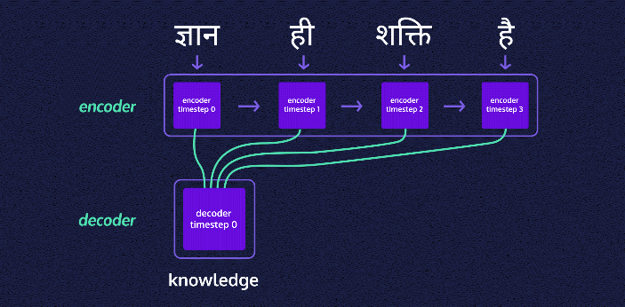
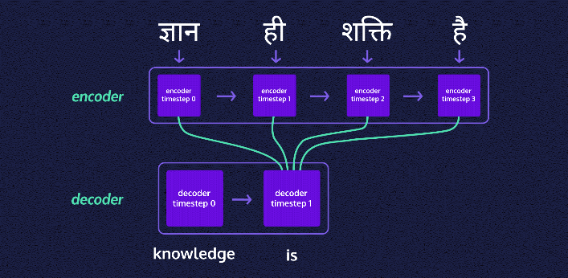
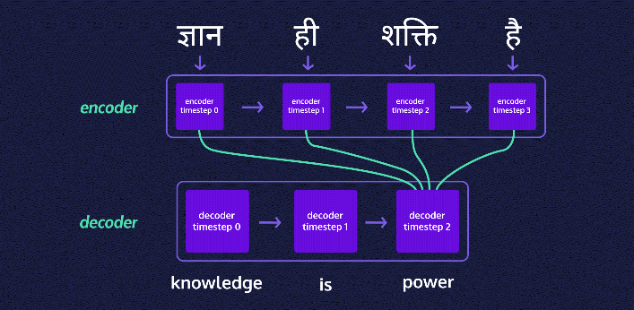
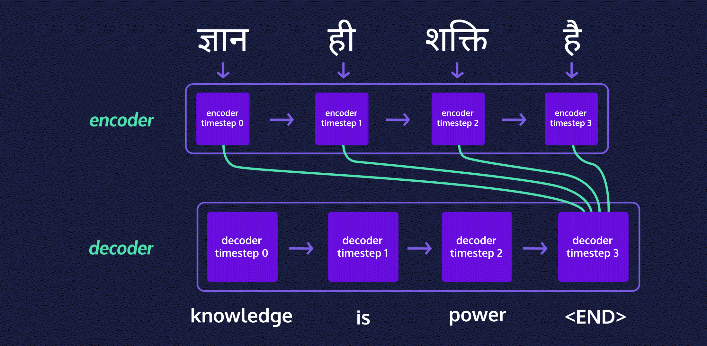
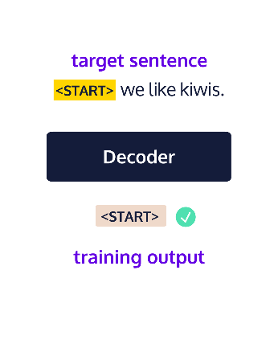
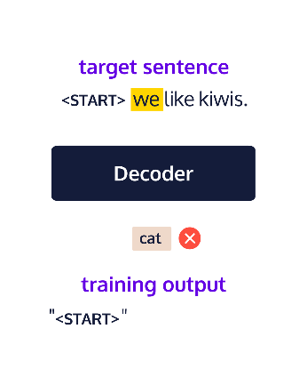
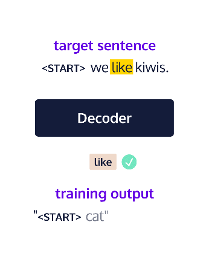
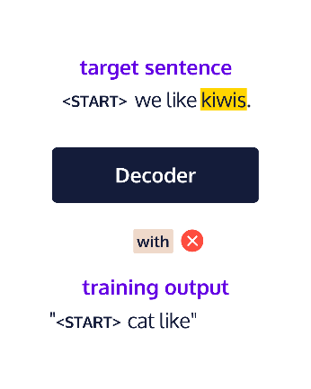
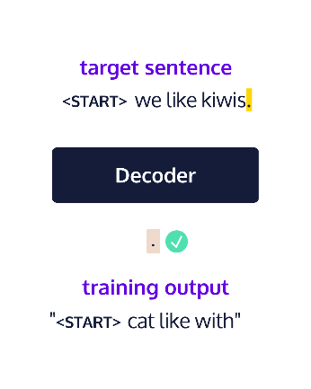

# Generating Text with Deep Learning

## Introduction to seq2seq

LSTMs are pretty extraordinary, but they’re only the tip of the iceberg when it comes to actually setting up and running a neural language model for text generation. In fact, an LSTM is usually just a single component in a larger network.

One of the most common neural models used for text generation is the sequence-to-sequence model, commonly referred to as *seq2seq* (pronounced “seek-to-seek”). A type of encoder-decoder model, seq2seq uses recurrent neural networks (RNNs) like LSTM in order to generate output, token by token or character by character.

So, where does seq2seq show up?

Machine translation software like Google Translate

-   Text summary generation
-   Chatbots
-   Named Entity Recognition (NER)
-   Speech recognition

seq2seq networks have two parts:

-   An *encoder* that accepts language (or audio or video) input. The output matrix of the encoder is discarded, but its state is preserved as a vector.
-   A *decoder* that takes the encoder’s final state (or memory) as its initial state. We use a technique called “teacher forcing” to train the decoder to predict the following text (characters or words) in a target sequence given the previous text.

In the images below, the phrase “knowledge is power” is translated from Hindi to English. Each state is passed through the encoder and on to each layer of the decoder.

 

 

## Pre-processing for seq2seq

If you’re feeling a bit nervous about building this all on your own, never fear. You don’t need to start from scratch — there are a few neural network libraries at your disposal. In our case, we’ll be using [TensorFlow](https://github.com/tensorflow/tensorflow) with the [Keras API](https://keras.io/) to build a pretty limited English-to-Spanish translator (we’ll explain this later and you’ll get an opportunity to improve it).

We can import Keras from Tensorflow like this:

```
from tensorflow import keras
```

The purpose of this lesson is for you to make sense of what each part of the code does and how you can modify it to suit your own needs. In fact, the code we’ll be using is mostly derived from [Keras’s own tutorial on the seq2seq model](https://keras.io/examples/nlp/lstm_seq2seq/).

First things first: pre-processing the text data. Noise removal depends on your use case — do you care about casing or punctuation? For many tasks they are probably not important enough to justify the additional processing. This might be the time to make changes.

We’ll need the following for our Keras implementation:

-   vocabulary sets for both our input (English) and target (Spanish) data
-   the total number of unique word tokens we have for each set
-   the maximum sentence length we’re using for each language

We also need to mark the start and end of each document (sentence) in the target samples so that the model recognizes where to begin and end its text generation (no book-long sentences for us!). One way to do this is adding "\<START\>" at the beginning and "\<END\>" at the end of each target document (in our case, this will be our Spanish sentences). For example, "Estoy feliz." becomes "\<START\> Estoy feliz. \<END\>".

```
from tensorflow import keras
import re
# Importing our translations
data_path = "span-eng.txt"
# Defining lines as a list of each line
with open(data_path, 'r', encoding='utf-8') as f:
  lines = f.read().split('\n')

# Building empty lists to hold sentences
input_docs = []
target_docs = []
# Building empty vocabulary sets
input_tokens = set()
target_tokens = set()

for line in lines:
  # Input and target sentences are separated by tabs
  input_doc, target_doc = line.split('\t')
  # Appending each input sentence to input_docs
  input_docs.append(input_doc)
  # Splitting words from punctuation
  target_doc = " ".join(re.findall(r"[\w']+|[^\s\w]", target_doc))
  # Redefine target_doc below 
  # and append it to target_docs:
  target_doc = "<START> " + target_doc + " <END>"
  target_docs.append(target_doc)
  
  # Now we split up each sentence into words
  # and add each unique word to our vocabulary set
  for token in re.findall(r"[\w']+|[^\s\w]", input_doc):
    print(token)
    # Add your code here:
    if token not in input_tokens:
      input_tokens.add(token)
    
  for token in target_doc.split():
    print(token)
    # And here:
    if token not in target_tokens:
      target_tokens.add(token)

input_tokens = sorted(list(input_tokens))
target_tokens = sorted(list(target_tokens))

# Create num_encoder_tokens and num_decoder_tokens:
num_encoder_tokens = len(input_tokens)
num_decoder_tokens = len(target_tokens)

try:
  max_encoder_seq_length = max([len(re.findall(r"[\w']+|[^\s\w]", input_doc)) for input_doc in input_docs])
  max_decoder_seq_length = max([len(re.findall(r"[\w']+|[^\s\w]", target_doc)) for target_doc in target_docs])
except ValueError:
  pass
```

## Training Setup (Part 1)

For each sentence, Keras expects a NumPy matrix containing *one-hot vectors* for each token. What’s a one-hot vector? In a one-hot vector, every token in our set is represented by a 0 except for the current token which is represented by a 1. For example given the vocabulary ["the", "dog", "licked", "me"], a one-hot vector for “dog” would look like [0, 1, 0, 0].

In order to vectorize our data and later translate it from vectors, it’s helpful to have a features dictionary (and a reverse features dictionary) to easily translate between all the 1s and 0s and actual words. We’ll build out the following:

-   a features dictionary for English
-   a features dictionary for Spanish
-   a reverse features dictionary for English (where the keys and values are swapped)
-   a reverse features dictionary for Spanish

Once we have all of our features dictionaries set up, it’s time to vectorize the data! We’re going to need vectors to input into our encoder and decoder, as well as a vector of target data we can use to train the decoder.

Because each matrix is almost all zeros, we’ll use numpy.zeros() from the NumPy library to build them out.

```
import numpy as np
 
encoder_input_data = np.zeros(
    (len(input_docs), max_encoder_seq_length, num_encoder_tokens),
    dtype='float32')
```

Let’s break this down:

We defined a NumPy matrix of zeros called encoder_input_data with two arguments:

-   the shape of the matrix — in our case the number of documents (or sentences) by the maximum token sequence length (the longest sentence we want to see) by the number of unique tokens (or words)
-   the data type we want — in our case NumPy’s float32, which can speed up our processing a bit

```
from tensorflow import keras
import numpy as np
from preprocessing import input_docs, target_docs, input_tokens, target_tokens, num_encoder_tokens, num_decoder_tokens, max_encoder_seq_length, max_decoder_seq_length

print('Number of samples:', len(input_docs))
print('Number of unique input tokens:', num_encoder_tokens)
print('Number of unique output tokens:', num_decoder_tokens)
print('Max sequence length for inputs:', max_encoder_seq_length)
print('Max sequence length for outputs:', max_decoder_seq_length)

# Define dictionary for input vocabulary
input_features_dict = dict(
    [(token, i) for i, token in enumerate(input_tokens)])
# Build out target_features_dict:
target_features_dict = dict(
    [(token, i) for i, token in enumerate(target_tokens)])

# Reverse-lookup token index to decode sequences back to
# something readable.
reverse_input_features_dict = dict(
    (i, token) for token, i in input_features_dict.items())
# Build out reverse_target_features_dict:
reverse_target_features_dict = dict(
    (i, token) for token, i in target_features_dict.items())

encoder_input_data = np.zeros(
    (len(input_docs), max_encoder_seq_length, num_encoder_tokens),
    dtype='float32')
print("\nHere's the first item in the encoder input matrix:\n", encoder_input_data[0], "\n\nThe number of columns should match the number of unique input tokens and the number of rows should match the maximum sequence length for input sentences.")

# Build out the decoder_input_data matrix:
decoder_input_data = np.zeros(
      (len(input_docs), max_decoder_seq_length, num_decoder_tokens),
      dtype='float32')

# Build out the decoder_target_data matrix:
decoder_target_data = np.zeros(
      (len(target_docs), max_decoder_seq_length, num_decoder_tokens),
      dtype='float32')
```

## Training Setup (Part 2)

At this point we need to fill out the 1s in each vector. We can loop over each English-Spanish pair in our training sample using the features dictionaries to add a 1 for the token in question. For example, the dog sentence (["the", "dog", "licked", "me"]) would be split into the following matrix of vectors:

```
[
  [1, 0, 0, 0], # timestep 0 => "the"
  [0, 1, 0, 0], # timestep 1 => "dog"
  [0, 0, 1, 0], # timestep 2 => "licked"
  [0, 0, 0, 1], # timestep 3 => "me"
]
```

You’ll notice the vectors have timesteps — we use these to track where in a given document (sentence) we are.

To build out a three-dimensional NumPy matrix of one-hot vectors, we can assign a value of 1 for a given word at a given timestep in a given line:

```
matrix_name[line, timestep, features_dict[token]] = 1.
```

Keras will fit — or train — the seq2seq model using these matrices of one-hot vectors:

-   the encoder input data
-   the decoder input data
-   the decoder target data

Hang on a second, why build two matrices of decoder data? Aren’t we just encoding and decoding?

The reason has to do with a technique known as *teacher forcing* that most seq2seq models employ during training. Here’s the idea: we have a Spanish input token from the previous timestep to help train the model for the current timestep’s target token.





```
for line, (input_doc, target_doc) in enumerate(zip(input_docs, target_docs)):

  for timestep, token in enumerate(re.findall(r"[\w']+|[^\s\w]", input_doc)):

    print("Encoder input timestep & token:", timestep, token)
    print(input_features_dict[token])
    # Assign 1. for the current line, timestep, & word
    # in encoder_input_data:
    encoder_input_data[line, timestep, input_features_dict[token]] = 1.

  for timestep, token in enumerate(target_doc.split()):

    # decoder_target_data is ahead of decoder_input_data by one timestep
    print("Decoder input timestep & token:", timestep, token)
    # Assign 1. for the current line, timestep, & word
    # in decoder_input_data:
    decoder_input_data[line, timestep, target_features_dict[token]] = 1.
    
    if timestep > 0:
      # decoder_target_data is ahead by 1 timestep
      # and doesn't include the start token.
      print("Decoder target timestep:", timestep)
      # Assign 1. for the current line, timestep, & word
      # in decoder_target_data:
      decoder_target_data[line, timestep-1, target_features_dict[token]] = 1.
```

## Encoder Training Setup

It’s time for some deep learning!

Deep learning models in Keras are built in layers, where each layer is a step in the model.

Our encoder requires two layer types from Keras:

-   An input layer, which defines a matrix to hold all the one-hot vectors that we’ll feed to the model.
-   An LSTM layer, with some output dimensionality.

We can import these layers as well as the model we need like so:

```
from keras.layers import Input, LSTM
from keras.models import Model
```

Next, we set up the input layer, which requires some number of dimensions that we’re providing. In this case, we know that we’re passing in all the encoder tokens, but we don’t necessarily know our batch size (how many sentences we’re feeding the model at a time). Fortunately, we can say None because the code is written to handle varying batch sizes, so we don’t need to specify that dimension.

```
# the shape specifies the input matrix sizes
encoder_inputs = Input(shape=(None, num_encoder_tokens))
```

For the LSTM layer, we need to select the dimensionality (the size of the LSTM’s hidden states, which helps determine how closely the model molds itself to the training data — something we can play around with) and whether to return the state (in this case we do):

```
encoder_lstm = LSTM(100, return_state=True)
# we're using a dimensionality of 100
# so any LSTM output matrix will have 
# shape [batch_size, 100]
```

Remember, the only thing we want from the encoder is its final states. We can get these by linking our LSTM layer with our input layer:

```
encoder_outputs, state_hidden, state_cell = encoder_lstm(encoder_inputs)
```

encoder_outputs isn’t really important for us, so we can just discard it. However, the states, we’ll save in a list:

```
encoder_states = [state_hidden, state_cell]
```

```
from prep import num_encoder_tokens

from tensorflow import keras
from keras.layers import Input, LSTM
from keras.models import Model

# Create the input layer:
encoder_inputs = Input(shape=(None, num_encoder_tokens))

# Create the LSTM layer:
encoder_lstm = LSTM(256, return_state=True)

# Retrieve the outputs and states:
encoder_outputs, state_hidden, state_cell = encoder_lstm(encoder_inputs)

# Put the states together in a list:
encoder_states = [state_hidden, state_cell]
```

## Decoder Training Setup

The decoder looks a lot like the encoder (phew!), with an input layer and an LSTM layer that we use together:

```
decoder_inputs = Input(shape=(None, num_decoder_tokens))
decoder_lstm = LSTM(100, return_sequences=True, return_state=True)
# This time we care about full return sequences
```

However, with our decoder, we pass in the state data from the encoder, along with the decoder inputs. This time, we’ll keep the output instead of the states:

```
# The two states will be discarded for now
decoder_outputs, decoder_state_hidden, decoder_state_cell = 
    decoder_lstm(decoder_inputs, initial_state=encoder_states)
```

We also need to run the output through a final activation layer, using the Softmax function, that will give us the probability distribution — where all probabilities sum to one — for each token. The final layer also transforms our LSTM output from a dimensionality of whatever we gave it (in our case, 10) to the number of unique words within the hidden layer’s vocabulary (i.e., the number of unique target tokens, which is definitely more than 10!).

```
decoder_dense = Dense(num_decoder_tokens, activation='softmax')
decoder_outputs = decoder_dense(decoder_outputs)
```

Keras’s implementation could work with several layer types, but Dense is the least complex, so we’ll go with that. We also need to modify our import statement to include it before running the code:

```
from keras.layers import Input, LSTM, Dense
from prep import num_encoder_tokens, num_decoder_tokens

from tensorflow import keras
# Add Dense to the imported layers
from keras.layers import Input, LSTM, Dense
from keras.models import Model

# Encoder training setup
encoder_inputs = Input(shape=(None, num_encoder_tokens))
encoder_lstm = LSTM(256, return_state=True)
encoder_outputs, state_hidden, state_cell = encoder_lstm(encoder_inputs)
encoder_states = [state_hidden, state_cell]

# The decoder input and LSTM layers:
decoder_inputs = Input(shape=(None, num_decoder_tokens))
decoder_lstm = LSTM(256, return_sequences=True, return_state=True)

# Retrieve the LSTM outputs and states:
decoder_outputs, decoder_state_hidden, decoder_state_cell = decoder_lstm(decoder_inputs, initial_state=encoder_states)

# Build a final Dense layer:
decoder_dense = Dense(num_decoder_tokens, activation='softmax')

# Filter outputs through the Dense layer:
decoder_outputs = decoder_dense(decoder_outputs)
```

## Build and Train seq2seq

Alright! Let’s get model-building!

First, we define the seq2seq model using the Model() function we imported from Keras. To make it a seq2seq model, we feed it the encoder and decoder inputs, as well as the decoder output:

```
model = Model([encoder_inputs, decoder_inputs], decoder_outputs)
```

Finally, our model is ready to train. First, we compile everything. Keras models demand two arguments to compile:

An optimizer (we’re using RMSprop, which is a fancy version of the widely-used [gradient descent](https://www.codecademy.com/courses/machine-learning/lessons/linear-regression/exercises/gradient-descent-b)) to help minimize our error rate (how bad the model is at guessing the true next word given the previous words in a sentence).

A loss function (we’re using the logarithm-based cross-entropy function) to determine the error rate.

Because we care about accuracy, we’re adding that into the metrics to pay attention to while training. Here’s what the compiling code looks like:

```
model.compile(optimizer='rmsprop', 
              loss='categorical_crossentropy',
              metrics=['accuracy'])
```

Next we need to fit the compiled model. To do this, we give the .fit() method the encoder and decoder input data (what we pass into the model), the decoder target data (what we expect the model to return given the data we passed in), and some numbers we can adjust as needed:

batch size (smaller batch sizes mean more time, and for some problems, smaller batch sizes will be better, while for other problems, larger batch sizes are better)

the number of epochs or cycles of training (more epochs mean a model that is more trained on the dataset, and that the process will take more time)

validation split (what percentage of the data should be set aside for validating — and determining when to stop training your model — rather than training)

Keras will take it from here to get you a (hopefully) nicely trained seq2seq model:

```
model.fit([encoder_input_data, decoder_input_data], 
          decoder_target_data,
          batch_size=10,
          epochs=100,
          validation_split=0.2)
```

```
from prep import num_encoder_tokens, num_decoder_tokens, decoder_target_data, encoder_input_data, decoder_input_data, decoder_target_data

from tensorflow import keras
# Add Dense to the imported layers
from keras.layers import Input, LSTM, Dense
from keras.models import Model

# Encoder training setup
encoder_inputs = Input(shape=(None, num_encoder_tokens))
encoder_lstm = LSTM(256, return_state=True)
encoder_outputs, state_hidden, state_cell = encoder_lstm(encoder_inputs)
encoder_states = [state_hidden, state_cell]

# Decoder training setup:
decoder_inputs = Input(shape=(None, num_decoder_tokens))
decoder_lstm = LSTM(256, return_sequences=True, return_state=True)
decoder_outputs, decoder_state_hidden, decoder_state_cell = decoder_lstm(decoder_inputs, initial_state=encoder_states)
decoder_dense = Dense(num_decoder_tokens, activation='softmax')
decoder_outputs = decoder_dense(decoder_outputs)

# Building the training model:
training_model = Model([encoder_inputs, decoder_inputs], decoder_outputs)

print("Model summary:\n")
training_model.summary()
print("\n\n")

# Compile the model:
training_model.compile(
  optimizer='rmsprop',
  loss='categorical_crossentropy',
  metrics=['accuracy'])

# Choose the batch size
# and number of epochs:
batch_size = 50
epochs = 50

print("Training the model:\n")
# Train the model:
training_model.fit(
  [encoder_input_data, decoder_input_data],
  decoder_target_data,
  batch_size=batch_size,
  epochs=epochs,
  validation_split=0.2)
```

## Testing Setup

Now our model is ready for testing! However, to generate some original output text, we need to redefine the seq2seq architecture in pieces. Wait, didn’t we just define and train a model?

Well, yes. But the model we used for training our network only works when we already know the target sequence. This time, we have no idea what the Spanish should be for the English we pass in! So we need a model that will decode step-by-step instead of using teacher forcing. To do this, we need a seq2seq network in individual pieces.

To start, we’ll build an encoder model with our encoder inputs and the placeholders for the encoder’s output states:

```
encoder_model = Model(encoder_inputs, encoder_states)
```

Next up, we need placeholders for the decoder’s input states, which we can build as input layers and store together. Why? We don’t know what we want to decode yet or what hidden state we’re going to end up with, so we need to do everything step-by-step. We need to pass the encoder’s final hidden state to the decoder, sample a token, and get the updated hidden state back. Then we’ll be able to (manually) pass the updated hidden state back into the network:

```
latent_dim = 256
decoder_state_input_hidden = Input(shape=(latent_dim,))
 
decoder_state_input_cell = Input(shape=(latent_dim,))
 
decoder_states_inputs = [decoder_state_input_hidden, decoder_state_input_cell]
```

Using the decoder LSTM and decoder dense layer (with the activation function) that we trained earlier, we’ll create new decoder states and outputs:

```
decoder_outputs, state_hidden, state_cell = 
    decoder_lstm(decoder_inputs, 
    initial_state=decoder_states_inputs)
 
# Saving the new LSTM output states:
decoder_states = [state_hidden, state_cell]
 
# Below, we redefine the decoder output
# by passing it through the dense layer:
decoder_outputs = decoder_dense(decoder_outputs)
```

Finally, we can set up the decoder model. This is where we bring together:

-   the decoder inputs (the decoder input layer)
-   the decoder input states (the final states from the encoder)
-   the decoder outputs (the NumPy matrix we get from the final output layer of the decoder)
-   the decoder output states (the memory throughout the network from one word to the next)

```
decoder_model = Model(
  [decoder_inputs] + decoder_states_inputs,
  [decoder_outputs] + decoder_states)
```

```
from training import encoder_inputs, decoder_inputs, encoder_states, decoder_lstm, decoder_dense

from tensorflow import keras
from keras.layers import Input, LSTM, Dense
from keras.models import Model, load_model

training_model = load_model('training_model.h5')
# These next lines are only necessary
# because we're using a saved model:
encoder_inputs = training_model.input[0]
encoder_outputs, state_h_enc, state_c_enc = training_model.layers[2].output
encoder_states = [state_h_enc, state_c_enc]

# Building the encoder test model:
encoder_model = Model(encoder_inputs, encoder_states)

latent_dim = 256
# Building the two decoder state input layers:
decoder_state_input_hidden = Input(shape=(latent_dim,))

decoder_state_input_cell = Input(shape=(latent_dim,))

# Put the state input layers into a list:
decoder_states_inputs = [decoder_state_input_hidden, decoder_state_input_cell]

# Call the decoder LSTM:
decoder_outputs, state_hidden, state_cell = decoder_lstm(decoder_inputs, initial_state=decoder_states_inputs)

decoder_states = [state_hidden, state_cell]

# Redefine the decoder outputs:
decoder_outputs = decoder_dense(decoder_outputs)

# Build the decoder test model:
decoder_model = Model(
  [decoder_inputs] + decoder_states_inputs,
  [decoder_outputs] + decoder_states
)
```

## The Test Function Part 1

Finally, we can get to testing our model! To do this, we need to build a function that:

-   accepts a NumPy matrix representing the test English sentence input
-   uses the encoder and decoder we’ve created to generate Spanish output

Inside the test function, we’ll run our new English sentence through the encoder model. The .predict() method takes in new input (as a NumPy matrix) and gives us output states that we can pass on to the decoder:

```
# test_input is a NumPy matrix
# representing an English sentence
states = encoder.predict(test_input)
```

Next, we’ll build an empty NumPy array for our Spanish translation, giving it three dimensions:

```
# batch size: 1
# number of tokens to start with: 1
# number of tokens in our target vocabulary
target_sequence = np.zeros((1, 1, num_decoder_tokens))
```

Luckily, we already know the first value in our Spanish sentence — "\<Start\>"! So we can give "\<Start\>" a value of 1 at the first timestep:

```
target_sequence[0, 0, target_features_dict['<START>']] = 1.
```

Before we get decoding, we’ll need a string where we can add our translation to, word by word:

```
decoded_sentence = ''
```

This is the variable that we will ultimately return from the function.

```
def decode_sequence(test_input):
  # Encode the input as state vectors:
  encoder_states_value = encoder_model.predict(test_input)
  # Set decoder states equal to encoder final states
  decoder_states_value = encoder_states_value
  # Generate empty target sequence of length 1:
  target_seq = np.zeros((1, 1, num_decoder_tokens))
  
  # Populate the first token of target sequence with the start token:
  target_seq[0, 0, target_features_dict['<START>']] = 1.
  
  decoded_sentence = ''

  return decoded_sentence

for seq_index in range(10):
  test_input = encoder_input_data[seq_index: seq_index + 1]
  decoded_sentence = decode_sequence(test_input)
  print('-')
  print('Input sentence:', input_docs[seq_index])
  print('Decoded sentence:', decoded_sentence)
```

## The Test Function Part 2

At long last, it’s translation time. Inside the test function, we’ll decode the sentence word by word using the output state that we retrieved from the encoder (which becomes our decoder’s initial hidden state). We’ll also update the decoder hidden state after each word so that we use previously decoded words to help decode new ones.

To tackle one word at a time, we need a while loop that will run until one of two things happens (we don’t want the model generating words forever):

-   The current token is "\<END\>".
-   The decoded Spanish sentence length hits the maximum target sentence length.

Inside the while loop, the decoder model can use the current target sequence (beginning with the "\<START\>" token) and the current state (initially passed to us from the encoder model) to get a bunch of possible next words and their corresponding probabilities. In Keras, it looks something like this:

```
output_tokens, new_decoder_hidden_state, new_decoder_cell_state = 
    decoder_model.predict(
    [target_seq] + decoder_states_value)
```

Next, we can use NumPy’s .argmax() method to determine the token (word) with the highest probability and add it to the decoded sentence:

```
# slicing [0, -1, :] gives us a
# specific token vector within the
# 3d NumPy matrix
sampled_token_index = np.argmax(
    output_tokens[0, -1, :])
 
# The reverse features dictionary
# translates back from index to Spanish
sampled_token = reverse_target_features_dict[
    sampled_token_index]
 
decoded_sentence += " " + sampled_token
```

Our final step is to update a few values for the next word in the sequence:

```
# Move to the next timestep 
# of the target sequence:
target_seq = np.zeros((1, 1, num_decoder_tokens))
target_seq[0, 0, sampled_token_index] = 1.
 
# Update the states with values from
# the most recent decoder prediction:
decoder_states_value = [
    new_decoder_hidden_state,
    new_decoder_cell_state]
```

And now we can test it all out!

You may recall that, because of platform constraints here, we’re using very little data. As a result, we can only expect our model to translate a handful of sentences coherently. Luckily, you will have an opportunity to try this out on your own computer with far more data to see some much more impressive results.

```
def decode_sequence(test_input):
  encoder_states_value = encoder_model.predict(test_input)
  decoder_states_value = encoder_states_value
  target_seq = np.zeros((1, 1, num_decoder_tokens))
  target_seq[0, 0, target_features_dict['<START>']] = 1.
  decoded_sentence = ''
  
  stop_condition = False
  while not stop_condition:
    # Run the decoder model to get possible 
    # output tokens (with probabilities) & states
    output_tokens, new_decoder_hidden_state, new_decoder_cell_state = decoder_model.predict([target_seq] + decoder_states_value)

    # Choose token with highest probability
    sampled_token = ""

    # Exit condition: either hit max length
    # or find stop token.
    if (sampled_token == '<END>' or len(decoded_sentence) > max_decoder_seq_length):
      stop_condition = True

    # Update the target sequence (of length 1).
    sampled_token_index = np.argmax(output_tokens[0, -1, :])
    sampled_token = reverse_target_features_dict[sampled_token_index]
    decoded_sentence += " " + sampled_token

    # Update states
    target_seq = np.zeros((1, 1, num_decoder_tokens))
    target_seq[0, 0, sampled_token_index] = 1.

    decoder_states_value = [new_decoder_hidden_state, new_decoder_cell_state]

  return decoded_sentence

for seq_index in range(10):
  test_input = encoder_input_data[seq_index: seq_index + 1]
  decoded_sentence = decode_sequence(test_input)
  print('-')
  print('Input sentence:', input_docs[seq_index])
  print('Decoded sentence:', decoded_sentence)
```

## Review

You’ve successfully built a machine translation program using deep learning with Tensorflow’s Keras API.

While the translation output may not have been quite what you expected, this is just the beginning. There are many ways you can improve this program on your own device by using a larger data set, increasing the size of the model, and adding more epochs for training.

You could also convert the one-hot vectors into word embeddings during training to improve the model. Using embeddings of words rather than one-hot vectors would help the model capture that semantically similar words might have semantically similar embeddings (helping the LSTM generalize).

You’ve learned quite a bit, even beyond the Keras implementation:

-   seq2seq models are deep learning models that use recurrent neural networks like LSTMs to generate output.
-   In machine translation, seq2seq networks encompass two main parts:
    -   The encoder accepts language as input and outputs state vectors.
    -   The decoder accepts the encoder’s final state and outputs possible translations.
-   Teacher forcing is a method we can use to train seq2seq decoders.
-   We need to mark the beginning and end of target sentences so that the decoder knows what to expect at the beginning and end of sentences.
-   One-hot vectors are a way to represent a given word in a set of words wherein we use 1 to indicate the current word and 0 to indicate every other word.
-   Timesteps help us keep track of where we are in a sentence.
-   We can adjust batch size, which determines how many sentences we give a model at a time.
-   We can also tweak dimensionality and number of epochs, which can improve results with careful tuning.
-   The Softmax function converts the output of the LSTMs into a probability distribution over words in our vocabulary.
