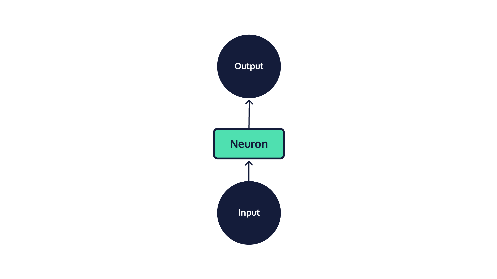
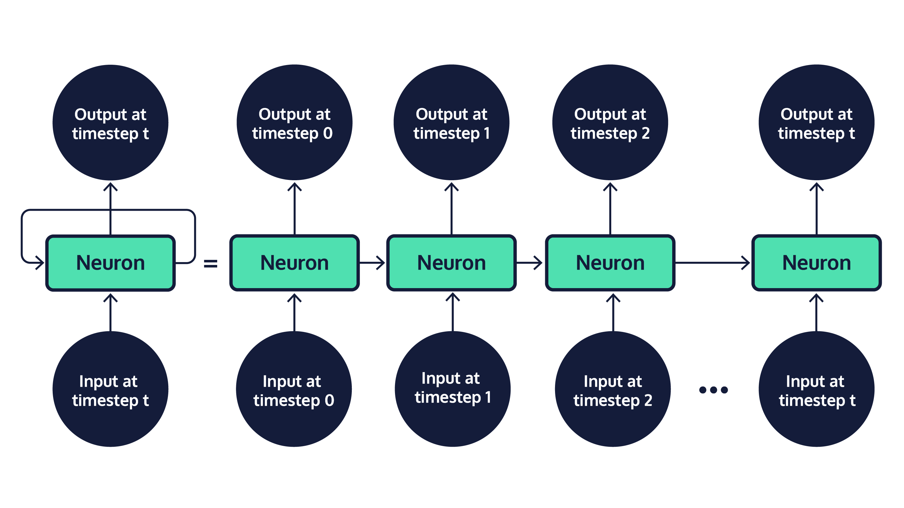
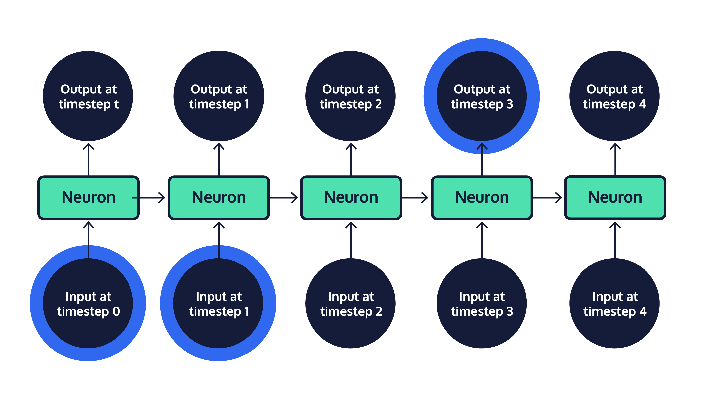
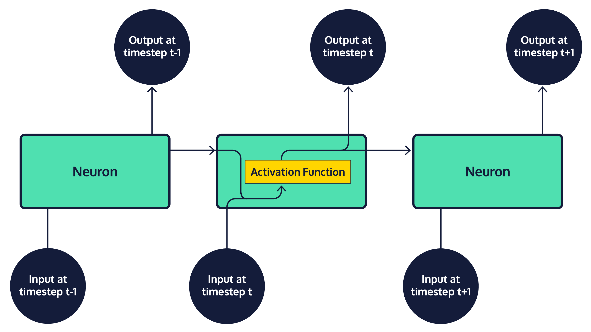
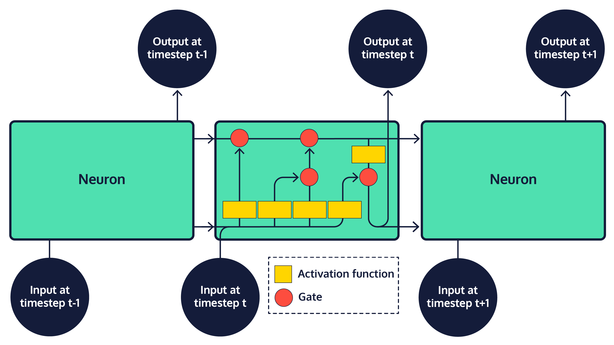
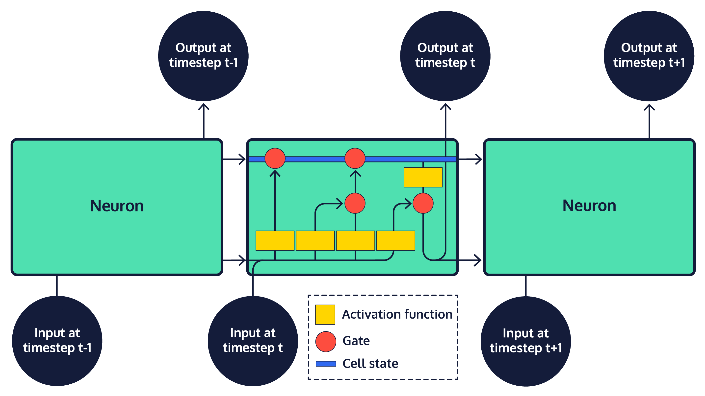

# Long Short Term Memory Networks

Long short-term memory networks (LSTMs) are often used in deep learning programs for natural language processing.

## Information Persistence and Neural Networks

We do not create a new language every time we speak –– every human language has a persistent set of grammar rules and collection of words that we rely on to interpret it. As you read this article, you understand each word based on your knowledge of grammar rules and interpretation of the preceding and following words. At the beginning of the next sentence, you continue to utilize information from earlier in the passage to follow the overarching logic of the paragraph. Your knowledge of language is both persistent across interactions, and adaptable to new conversations.

Neural networks are a machine learning framework loosely based on the structure of the human brain. They are very commonly used to complete tasks that seem to require complex decision making, like speech recognition or image classification. Yet, despite being modeled after neurons in the human brain, early neural network models were not designed to handle temporal sequences of data, where the past depends on the future. As a result, early models performed very poorly on tasks in which prior decisions are a strong predictor of future decisions, as is the case in most human language tasks. However, more recent models, called recurrent neural networks (RNN), have been specifically designed to process inputs in a temporal order and update the future based on the past, as well as process sequences of arbitrary length.

RNNs are one of the most commonly used neural network architectures today. Within the domain of Natural Language Processing, they are often used in speech generation and machine translation tasks. Additionally, they are often used to solve speech recognition and optical character recognition tasks. Let’s dive into their implementation!

## Neural Networks

A single neuron in a network, *reference to graphic*, takes in a single piece of input data, *reference to graphic*, and performs some data transformation to produce a single piece of output *reference to graphic*. The very first network models, called [perceptrons](https://www.codecademy.com/courses/machine-learning/lessons/perceptron), were relatively simple systems that used many combinations of simple functions, like computing the slope of a line. While these transformations were very simple in isolation, together they resulted in sophisticated behavior for the entire system and allowed for large numbers of transformations to be strung together in order to compute advanced functions. However, the range of perceptron applications was still limited, and there were very simple functions that they just simply couldn’t compute. In attempting to solve this issue by layering perceptrons together, researchers ran into another problem: few computers at the time were able to store enough data to execute these programs.

## Deep Neural Networks

By the early 2000s, when innovations in computer hardware allowed for more complex modeling techniques, researchers had already developed neural network systems that combined many layers of neurons, including convolutional neural networks (CNN), multi-layer perceptrons (MLP), and recurrent neural networks (RNN). All three of these architectures are called deep neural networks, because they have many layers of neurons that combine to create a “deep” stack of neurons. Each of these deep-learning architectures have their own relative strengths:

MLP networks are comprised of layered perceptrons. They tend to be good at solving simple tasks, like applying a filter to each pixel in a photo.

CNN networks are designed to process image data, applying the same convolution function across an entire input image. This makes it simpler and more efficient to process images, which generally yields very high-dimensional output and requires a great deal of processing.

Finally, RNNs became widely adopted within natural language processing because they integrate a loop into the connections between neurons, allowing information to persist across a chain of neurons.

When the chain of neurons in an RNN is “rolled out,” it becomes easier to see that these models are made up of many copies of the same neuron, each passing information to its successor. Neurons that are not the first or last in a rolled out RNN are sometimes referred to as “hidden” network layers; the first and last neurons are called the “input” and “output” layers, respectively. The chain structure of RNNs places them in close relation to data with a clear temporal ordering or list-like structure — such as human language, where words obviously appear one after another. Standard RNNs are certainly the best fit for tasks that involve sequences, like the translation of a sentence from one language to another.

## Long-term Dependencies

While the broad family of RNNs powers many of today’s advanced artificial intelligence systems, one particular RNN variant, the long short-term memory network (LSTM), has become popular for building realistic chatbot systems. When attempting to predict the next word in a conversation, words that were mentioned recently often provide enough information to make a strong guess. For instance, when trying to complete the sentence “The grass is always: **\___\_**,” most English-speakers do not need additional context to guess that the last word is “greener.” Standard RNNs are difficult to train, and fail to capture long-term dependencies well; they perform best on short sequences, when relevant context and the word to be predicted fall within a short distance of one another. However, there are also many cases of longer sequences in which more context is needed to make an accurate prediction, and that context is less obvious and at a greater lexical distance from the word it determines than in the example above. For instance, consider trying to complete the sentence “It is winter and there has been little sunlight. The grass is always \_____.” While the structure of the second sentence suggests that our word is probably an adjective related to grass, we need context from further back in the text to guess that the correct word is “brown.” As the gap between context and the word to predict grows, standard RNNs become less and less accurate. This situation is commonly referred to as the long-term dependency problem. The solution to this problem? A neural network specifically designed for long-term memory — the LSTM!

## Long Short-term Memory Networks

Every model in the RNN family, including LSTMs, is a chain of repeating neurons at its base. Within standard RNNs, each layer of neurons will only perform a single operation on the input data. However, within an LSTM, groups of neurons perform four distinct operations on input data, which are then sequentially combined. The most important aspect of an LSTM is the way in which the transformed input data is combined by adding results to *state*, or cell memory, represented as vectors. There are two states that are produced for the first step in the sequence and then carried over as subsequent inputs are processed: cell state, and hidden state. The *cell state* carries information through the network as we process a sequence of inputs. At each *timestep*, or step in the sequence, the updated input is appended to the cell state by a gate, which controls how much of the input should be included in the final product of the cell state. This final product, which is fed as input to the next neural network layer at the next timestep, is called a *hidden state*. The final output of a neural network is often the result contained in the final hidden state, or an average of the results across all hidden states in the network.

The persistence of the majority of a cell state across data transformations, combined with incremental additions controlled by the gates, allows for important information from the initial input data to be maintained in the neural network. Ultimately, this allows for information from far earlier in the input data to be used in decisions at any point in the model.
