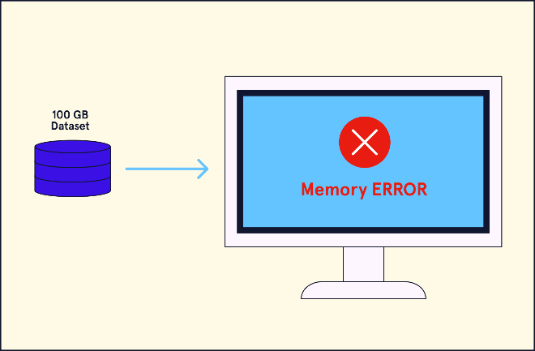

# Spark RDDs with PySpark – What is Spark?

**Learn about Apache Spark and its application for big data analysis**

Most data analysis solutions require that data be accessed and then pulled into memory before data processing tasks can be performed. When the dataset being analysed is so large that it exceeds the random access memory (RAM) limitations of the computer being used, analysis is impossible.

For example, most standard laptop computers today come with 16 GB or 32 GB of RAM with 2-5 GB allocated to the operating system and background processes. If there is a 100 GB dataset that needs to be analysed, then pulling the dataset into a pandas DataFrame, for example, is not possible.

To solve the problem of storing big data, we can split up a dataset and store it across multiple computers. This framework is known as a distributed file system. A popular choice is the Hadoop Distributed File System (HDFS), which splits up a dataset and stores it across multiple worker nodes in a cluster.

MapReduce is a computing framework for analysing datasets housed on a distributed file system like HDFS. MapReduce is a disk-oriented method, which means MapReduce writes data to disk in intermediate steps of analysis. While this method allows us to process data stored on the HDFS, it can still be a slow process for analysing larger datasets.

## Apache Spark and PySpark

As big data processing needs have grown, new technology has been developed. Spark is an analytics engine originally developed at UC Berkeley and eventually donated to the open-sourced Apache Software Foundation. Spark was designed as a solution for processing big datasets and was specifically developed to build data pipelines for machine learning applications. Like MapReduce, Spark does not have its own file storage system and is designed to be used with distributed file systems like HDFS. However, Spark can also be run on a single node (single computer) in stand-alone mode with a non-distributed dataset.

Spark uses the RAM of each cluster node in unison, harnessing the power of multiple computers. Spark applications execute analyses up to 100 times faster than MapReduce because Spark caches data and intermediate tables in RAM rather than writing them to disk. However, as datasets become larger, the advantage of using RAM decreases and can disappear altogether.

## What is PySpark?

Spark was originally developed in Scala (an object-oriented and functional programming language). This presented users with the additional hurdle of learning to code in Scala to work with Spark. PySpark is an API developed to minimize this learning obstacle by allowing programmers to write Python syntax to build Spark applications. There are also APIs for Java and R.

## How Spark Works

Now that we have a general understanding of Spark, let’s explore how a Spark application works in more detail. The Spark driver is the entry point of a Spark application and is used to create a Spark session. The driver program communicates with the cluster manager to create resilient distributed datasets (RDDs). To create an RDD, the data is divided up and distributed across worker nodes in a cluster. Copies of the RDD across the nodes ensure that RDDs are *fault-tolerant*, so information is recoverable in the event of a failure. Two types of operations can be performed on RDDs:

1.  **Transformations** manipulate RDDs on the cluster.
2.  **Actions** return a computation back to the main driver program.

The cluster manager determines the resources that the Spark application requires and assigns a specific number of worker nodes as executors to handle the processing of RDDs. Spark can be run on top of three different cluster managers, including Hadoop’s YARN and Apache Mesos.

## Spark Modules

The driver program is the core of the Spark application, but there are also modules that have been developed to enhance the utility of Spark. These modules include:

-   **Spark SQL**: an API that converts SQL queries and actions into Spark tasks to be distributed by the cluster manager. This allows for the integration of existing SQL pipelines without redevelopment of code and subsequent testing required for quality control.
-   **Spark Streaming**: a solution for processing live data streams that creates a discretized stream (Dstream) of RDD batches.
-   **MLlib and ML**: machine learning modules for designing pipelines used for feature engineering and algorithm training. ML is the DataFrame-based improvement on the original MLlib module.
-   **GraphX**: a robust graphing solution for Spark. More than just visualizing data, this API converts RDDs to resilient distributed property graphs (RDPGs) which utilize vertex and edge properties for relational data analysis.

## Spark Limitations

Spark is a powerful tool for working with big data, but it does come with some limitations:

1.  **Expensive hardware requirements**: Spark provides a solution for more time-efficient analyses of large distributed datasets, but Spark analyses are much less cost-effective. The costs associated with Spark come from the need for a lot of RAM built into the worker nodes of a cluster. RAM is much more expensive than disk memory.
2.  **Real-time processing is not possible**: Spark Streaming offers near real-time data processing, but true real-time data analysis is not supported.
3.  **Manual optimization is required**: The benefits and power of Spark must be optimized by the developer, which requires an advanced understanding of the program and backend, creating a technical hurdle for developers.

**Spark Use Cases**

TripAdvisor is an online travel site that sources, generates, and analyzes massive amounts of data per day. All of the data processing for TripAdvisor is done using Spark. Natural language processing of reviews is [an example shared by TripAdvisor in an article on their site.](https://www.tripadvisor.com/engineering/using-apache-spark-for-massively-parallel-nlp/)

MyFitnessPal is a popular application for smartwatches and smartphones owned by Under Armour that tracks the diet and exercise of its users. The app utilizes Spark to analyze user data for their users and internal marketing demographic classification. You can [read more about how MyFitnessPal uses Spark in this article by the Wall Street Journal.](https://www.wsj.com/articles/BL-CIOB-7254)

We can find many other examples of Spark use cases for commercial business and research projects in recent years. There are also many other big data analysis solutions that are built using Spark code or using similar concepts. Some examples include:

-   Delta Lake
-   Apache Mesos
-   Rumble (Apache)
-   DataBricks

For all of these reasons, understanding Spark is fundamental for anyone who works with big data.
